---
# Informació general del document
title: 2. Ferramentes GPT
lang: ca
page-background: img/bg.png
linkcolor: blue

# Portada
titlepage: true
titlepage-rule-height: 2
titlepage-rule-color: eeeee4
titlepage-text-color: eeeee4
titlepage-background: img/U2v.png

# Taula de continguts
toc: true
toc-own-page: true
toc-title: Continguts

# Capçaleres i peus
header-left: 2. Ferramentes GPT
header-right: Curs 2024-2025
footer-left: CEFIRE FP
footer-right: \thepage/\pageref{LastPage}

# Imatges
float-placement-figure: H
caption-justification: centering

# Llistats de codi
listings-no-page-break: true
listings-disable-line-numbers: false

header-includes:
- |
  ```{=latex}
  \usepackage{lastpage}
  \usepackage{awesomebox}
  \usepackage{caption}
  \usepackage{array}
  \usepackage{tabularx}
  \usepackage{ragged2e}
  \usepackage{multirow}
  \usepackage{xcolor}

  ```
pandoc-latex-environment:
  noteblock: [note]
  tipblock: [tip]
  warningblock: [warning]
  cautionblock: [caution]
  importantblock: [important]
...

<!-- \awesomebox[violet]{2pt}{\faRocket}{violet}{Lorem ipsum…} -->

<!-- \awesomebox[violet]{2pt}{\faRobot}{violet}{Lorem ipsum…} -->

<!-- IMATGE  -->

<!-- \textbf{greatest} -->

<!-- \awesomebox[violet]{2pt}{\faRobot}{violet}{\textbf{greatest}} -->

\vspace*{\fill}

{ height=50px }

Aquest document està subjecte a una llicència creative commons que permet la seua difusió i ús comercial reconeixent sempre l'autoria del seu creador. Aquest document es troba per a ser modificat al següent repositori de github:
<!-- CANVIAR L'ENLLAÇ -->
[https://github.com/arvicenteboix/AICurs25](https://github.com/arvicenteboix/AICurs25)

\newpage

# Introducció

En aquesta unitat anem a centrar-nos ja en aquelles aplicacions de les que tot el món parla. I, com no, aquelles que, en essència, més ens poden facilitar la tasca com a docents. Cal insistir però que l'objectiu d'aquest curs no tracta de veure quin és tot el potencial de les ferramentes GPT per als docents, sino de tindre un primer contacte amb aquestes ferramentes. 

Cal dir que ens hem centrat en la part gratuïta d'aquestes ferramentes, però la versió de pagament dona millors resultats i presenta funcionalitats molt convenients per a la nostra tasca, com la de crear GPTs.

# Què és GPT?

GPT és una sigla que significa "Generative Pre-trained Transformers". És una tecnologia que ajuda a les màquines a entendre el llenguatge humà i a respondre a preguntes de manera semblant a com ho faria una persona, és més, podem interactuar amb ella. Això vol dir que les màquines poden escriure textos, resumir informació, fer traduccions i algunes coses més que veurem més endavant. Això és possible gràcies a una xarxa neuronal que ha après a partir de moltes dades i que pot generar contingut nou partint del que ha après. GPT és una tecnologia molt útil per a moltes coses diferents; és més, cada vegada que parleu amb ella està aprenent del que parla amb vosaltres, així que segons avança el temps, té millors respostes.

# MODELS GPT

Els tres serveis més coneguts, encara que no són els únics, són ChatGPT, Gemini i Copilot. Nosaltres ens centrarem en aquests 3. En essència, són finestres de xat, encara que la implementació de cadascuna reflectix un llenguatge de disseny diferent. **Gemini** és la més minimalista, mentre que **Copilot** és la menys senzilla i es centra més en la funcionalitat.

Pel que fa a les capacitats de cadascuna, abans podríem dir que **ChatGPT** és millor per a conversar, mentre que **Copilot** és més adequada per a investigar. Per exemple, pot buscar a la web i proporcionar resultats de cerca, mentre que **ChatGPT** es centra en respondre preguntes i mantenir una conversa fluïda. Però este diferències van reduint-se amb el temps i, la millor opció dependrà de la experiència que tinguen amb les diferents ferramentes.

:::note
Òbviament, aquesta informació està basada en experiència personal i en la lectura d'alguns articles que et donen una idea de les característiques de cadascun. Es tracta de diferents models (important el fet de ser diferents) que van creixent amb el temps.

(1) [https://www.androidauthority.com/chatgpt-vs-bing-chat-3292126/](https://www.androidauthority.com/chatgpt-vs-bing-chat-3292126/)
(2) [https://zapier.com/blog/chatgpt-vs-bard/](https://zapier.com/blog/chatgpt-vs-bard/)
:::

## ChatGPT

Per a poder utilitzar chatGPT, en primer lloc hem de registrar-nos. Anirem a la pàgina de [ChatGPT](https://chat.openai.com/auth/login)

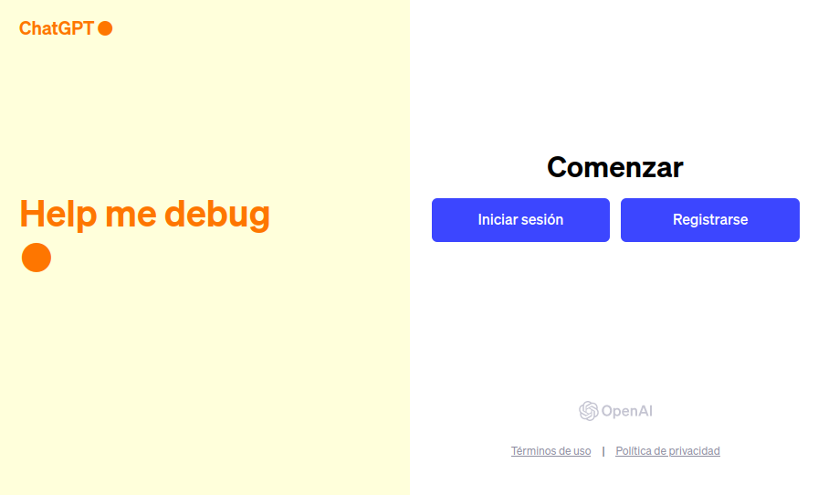

Després hem de posar unes dades o si estàs logat al navegador amb un compte de Google, entres amb ell:


Una vegada ja t'hages registrat podràs accedir directament a la pàgina de chatGPT per a començar, i ja li podem plantejar una qüestió:

[https://chat.openai.com/](https://chat.openai.com/)

\awesomebox[violet]{2pt}{\faRobot}{violet}{\textbf{Quina IA és millor, ChatGPT, Gemini o Copilot}\hfill \break
Com que no especifica sobre què vol una resposta, oferiré una resposta general. La idoneïtat d'una Intel·ligència Artificial (IA) depèn molt del context, les necessitats i els objectius específics de la situació. Hi ha diferents tipus d'IA, com ara sistemes de processament de llenguatge natural, sistemes de visió per computador, IA per a anàlisi de dades, entre altres.

Per determinar quina IA és la més idònia, s'han de tenir en compte diversos factors, com ara la complexitat del problema, els recursos disponibles, les capacitats de l'IA en qüestió i altres consideracions tècniques i pràctiques.

Alguns dels sistemes d'IA més coneguts inclouen OpenAI's GPT, Google's TensorFlow, i Microsoft's Azure Cognitive Services, però hi ha molts altres proveïdors d'IA i tecnologies disponibles.

Per tant, per triar la IA més idònia, és important avaluar les necessitats particulars del teu projecte o aplicació i comparar les capacitats i les limitacions de les diferents opcions disponibles.}

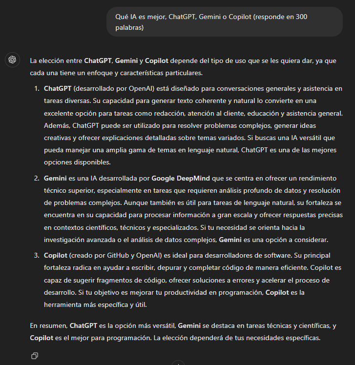

Podem veure que baix de cada resposta hi ha 4 icones que ens permetran valorar la resposta, copiar el text per a després apegar-lo on ens faça falta o que torne a regenerar la resposta.

## Copilot

Per poder utilitzar l'eina de IA de Microsoft no cal registrar-se, podem utilitzar-la directamente des del navegador, podem anar directament a la pàgina de [Bing](https://www.bing.com/) i ja podrem utilitzar directament la ferramenta. Fem clic sobre l'enllaç *chat*" (en versions més actuals posa directament "Copilot"):


Ens apareixerà aquesta pantalla i ja podem preguntar directament:

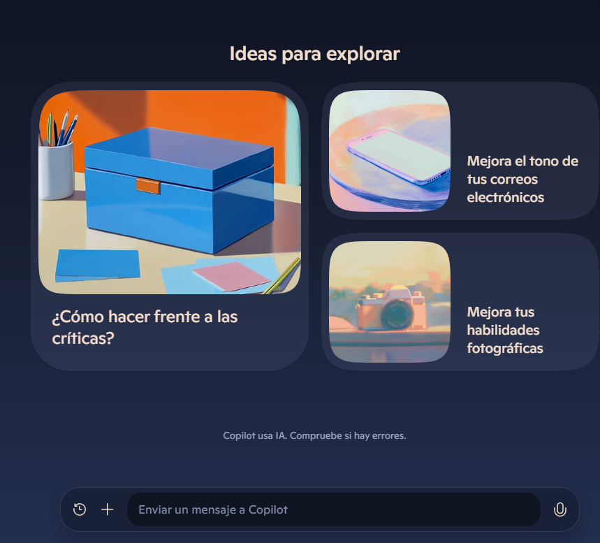

:::note
La versió corporativa (si este autenticats amb @edu.gva.es) és diferent.
:::

\awesomebox[violet]{2pt}{\faRobot}{violet}{\textbf{Quina IA és millor, ChatGPT, Gemini o Copilot}\hfill \break
Hi ha moltes IA de xat per triar, i la millor depèn del que busquis. Segons una comparació recent de Tom's Guide, ChatGPT Plus i Copilot Pro són dues de les millors opcions disponibles. Tots dos utilitzen la mateixa tecnologia subjacent que impulsa el chatbot de OpenAI. Els dos també cobren el mateix preu per mes, 20 dòlars. Copilot Pro inclou accés a totes les funcions de 365 Copilot, cosa que el diferencia de ChatGPT Plus. Google també llançarà Gemini Advanced, una versió premium del chatbot que estarà impulsada pel nou model Gemini Ultra més endavant aquest any. Però, si busques una IA de xat gratuïta, potser voldràs provar altres opcions com Poe, Perplexity AI o Pi.

Espero que això t'ajudi a triar la millor IA de xat per a les teves necessitats.
}

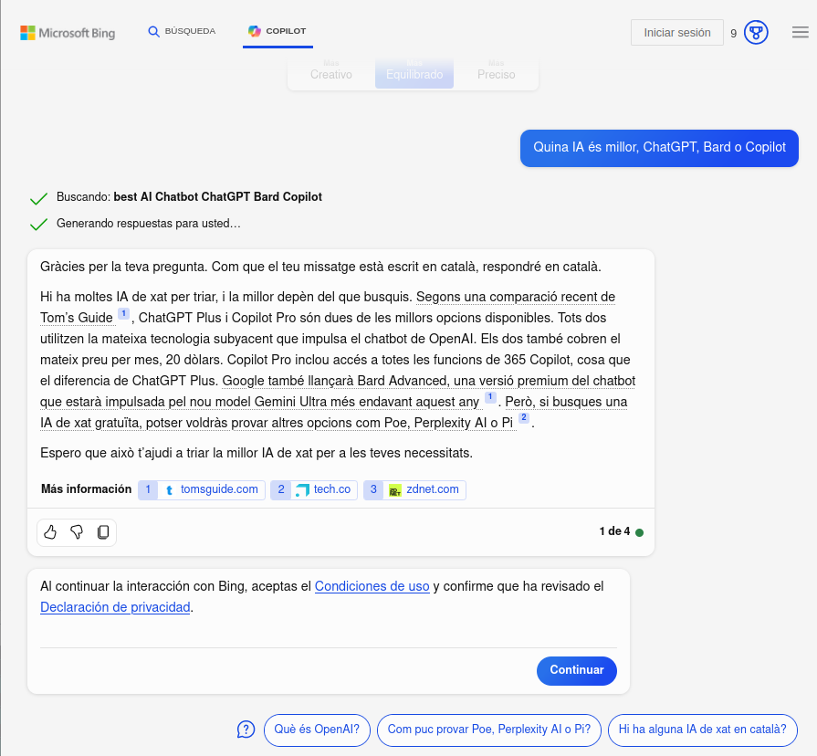

Podem veure que la resposta que ens dona és bastant diferent a la que ens ha oferit ChatGPT, al igual que l'anterior també ens permet copiar el text i valorar-lo. Una de les coses destacables és que ens proporciona informació d'on ha extret la seua resposta i ens aporta els enllaços per si volem ampliar informació.

## Gemini

En aquest cas haurem d'anar a la pàgina de [Gemini](https://Gemini.google.com/chat). De la mateixa manera caldrà que et crees un compte de google i entres amb aquest compte, sinó no la podràs utilitzas.

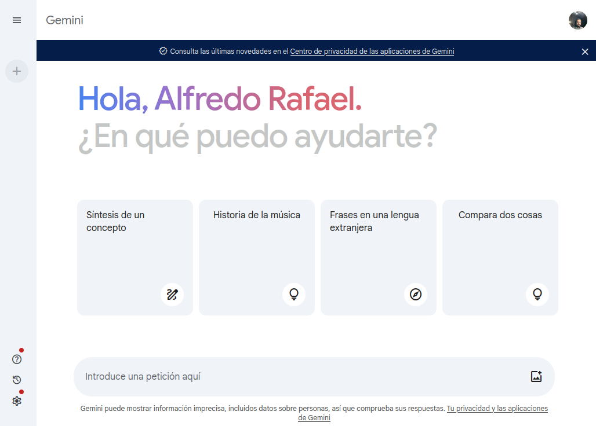

De la mateixa manera provarem amb Gemini què pensa dels seus companys:

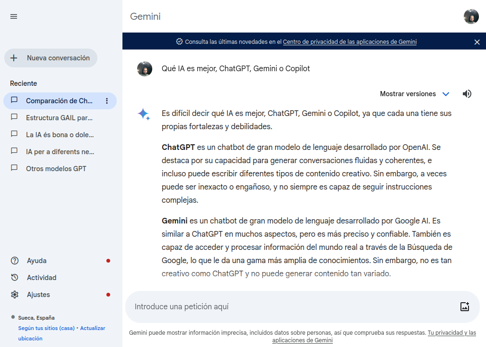

En aquest cas no anem a transcriure tota la resposta perquè és més llarga que les altres, però cal destacar algunes coses interessants d'aquesta interfície (que no model).

* Ens permet al igual que les altres valorar la resposta o regenerar-la.
* Però podem veure que ja ha dissenyat 3 versions.
* La resposta ha sigut molt més ràpida que en les altres dos.
* Ens proporciana la icona de Google per si volem ampliar informació.
* Ens dóna la referència sobre el text d'on ha tret la informació si el sol·licitem.


## Altres models coneguts

Encara que aquests són els 3 models més coneguts, hi ha altres models d'eines GPT que es poden utilitzar gratuïtament. A continuació, es presenten alguns exemples:

- **Perplexity AI** és una eina de generació de textos que utilitza GPT-3 per a generar contingut creatiu, com ara articles, anuncis, guions, peces musicals, correus electrònics, cartes, etc. Permet fer consultes ràpides. Pots accedir des [d'ací](https://perplexity.ai/)
- **TextCortex** és una eina basada en GPT-4 que permet generar text, traduir idiomes, escriure diferents tipus de contingut creatiu i respondre preguntes de manera informativa. Ofereix un pla gratuït amb un límit de 200 caràcters per generació. Podem accedir des [d'ací](https://app.textcortex.com)
- **Writesonic** és una eina de redacció automatitzada que utilitza GPT-3 per generar contingut de alta qualitat, com ara articles, anuncis, guions, peces musicals, correus electrònics, cartes, etc. Ofereix un pla gratuït amb un límit de 10 creacions per dia. Podem accedir des [d'ací](https://app.writesonic.com/)
- **Jasper** (abans Jarvis) és una altra eina de redacció automatitzada que utilitza GPT-3. Ofereix un pla gratuït amb un límit de 10.000 paraules al mes. Podem accedir des [d'ací](https://app.jasper.ai/)
- **Copy AI** és una eina de creació de contingut que utilitza GPT-3 per generar textos, anuncis, guions, peces musicals, correus electrònics, cartes, etc. Ofereix un pla gratuït amb un límit de 10 creacions per dia. Podem accedir des [d'ací](https://www.copy.ai/)
- **Rytr** és una eina de redacció automatitzada que utilitza GPT-3. Ofereix un pla gratuït amb un límit de 50 creacions per dia. Podem accedir des [d'ací](https://rytr.me/)
- **Poe** un altre chatbot de propòsit general, té una limitació de certes qüestions al dia. Pots accedir des d'aquí: [https://poe.com/login](https://poe.com/login)
- **Ora.sh** Amb dades fins 2021 és una altre model de llenguatge [https://ora.ai/openai/gpt4](https://ora.ai/openai/gpt4)

Especial menció a **Code llama 2** [https://ai.meta.com/llama/](https://ai.meta.com/llama/) es tracta d'un model d'IA que pots descarregar al teua ordinador, però requerix de coneixements tècnics un poc avançats per a poder fer-lo funcionar i una màquina bastabt potent. Però tindrem el nostre propi model de llenguatge en el nostre ordinador. Parlarem d'ella en l'últim punt d'esta unitat.

Com pots veure, la disponibilitat d'eines GPT gratuïtes és molt gran i cada vegada hi han més oferta disponible. Això facilita als usuaris l'accés a les capacitats d'aquests models de llenguatge sense haver de pagar una subscripció.

:::important
Hem vist que totes elles presenten una versió de pagament. En principi en la majoria del casos no és necessari fer cap pagament. La versió de pagament ens permetrà accedir a altres models més amplis i tindre menors limitacions. Quan utilitzem el model Llama al final de la unitat veurem que el que estem pagant finalment és capacitat de processament.
:::

## Quina ferramenta escollir?

Aquella que millor s'adapte a les teues necessitats i a les seues respostes. Cadascuna d'elles ha tingut un entrenament diferent, per tant a mesura que vages treballant en cadascuna d'elles veuràs que sempre tendixes a utilitzar la mateixa.

En aquest cas caldria utilitzar-ne varies i no centrar-se'n en les 3 principals ja que aquelles no tan conegudes poden donar respostes tan vàlides o inclús millors que les altres.

De tota manera una cosa és certa, un persona pot ser molt intel·ligent i tenir una molt bona conversa però si qui conversa amb ella no és un bon conversador no podrà traure el seu potencial.

Per això cal saber preguntar adequadament a la IA què és el que volem i no pots preguntar com a un humà ja que esta tecnologia no sap pressuposar coses després de parlar en tu, cal que ser clar amb el que preguntem. A les qüestions que li plantegem a la IA ho anomenem **prompts**. Si a la IA no li escrius un bon prompt, no funciona bé, i no et donarà una bona resposta.

# Creant prompts

El prompts, com ja hem comentat, són aquells comandaments que anem a a donar-li a la intel·ligència artificial. A partir d'una qüestió o prompt esperem que ens done la resposta més pareguda a la desitjada. Una de les màximes que cal aplicar en aquests casos és que la qüestió ha de ser tan clara que la IA no haja de pressuposar res.

Un exemple clar són en les tasques del dia a dia, si a casa li dius a algú "ves a fer la compra" és possible que ja tinga una idea del que ha de fer, on ha d'anar a comprar i en quina ciutat, quan pots anar a comprar, on trobar la llista de la compra, el pressupost, els objectes prioritaris, les alternatives si no hi ha un producte i quines manies tenen els membres de la familia. Totes aquestes coses la IA no les sap, per tant els prompts no poden semblar-se a les qüestions que plantegem en el nostre dia a dia, hem de definir més exactament què és el que volem.

Altra de les coses que cal tenir en compte, i és molt important, és que no és el mateix preguntar d'un tema que desconeixes a altre que tens bastants coneixements, sempre podràs plantejar millor el prompt per a poder obtindre els millors resultats.

Aquí tractarem de donar una sèrie d'orientacions per a plantejar prompts, al final, partint d'aquestes orientacions i en funció del que vages a realitzar acabaràs creant-te el teu propi esquema mental per a traure els resultats que més s'adapten a les teues necessitats, i aquest no tenen perquè ser aptes per a tots.

## Estructures modulars per a la creació de prompts

La estructura de referencia que Microsoft recomana per a la creació de prompts inclou quatre elements clau:

- **Objectiu**: L'objectiu del prompt, és a dir, el que es vol aconseguir amb la resposta.
- **Context**: El context en què es fa la pregunta o es demana la resposta.
- **Exemples**: Exemples concrets que il·lustren el que es vol aconseguir amb la resposta.
- **Expectatives**: Les expectatives per a la resposta, com ara la longitud, el contingut i el to.

Les estructures modulars són una manera eficaç de crear prompts clars i senzills per a diferents tasques. Aquí tens una breu descripció d'estructures:

- **RTF**: RTF és una estructura modular per a crear prompts de Rol, Tasca i Format. Aquesta estructura és molt útil per a fer prompts clars i senzills per a diferents tasques. Aquí tens un exemple de com es pot utilitzar l’estructura RTF en un prompt:

    - **Role**: Professor
    - **Task**: Explica com funciona el sistema solar.
    - **Format**: Utilitza un llenguatge senzill i exemples visuals.


- **TAG**: L'estructura TAG (Task, Action, Goal) és una eina que es pot utilitzar per a definir tasques i objectius clars i senzills. La estructura TAG es compon de tres elements:

    - **Tasca**: La tasca que s'ha de realitzar.
    - **Acció**: L'acció que s'ha de dur a terme per a completar la tasca.
    - **Objectiu**: L'objectiu final de la tasca.

    L'estructura TAG es pot utilitzar per a crear prompts que inclouen informació sobre la tasca, l'acció i l'objectiu.

- **GAIDE**: L'estructura GAIDE (Goal, Actor, Instructions, Details, Examples) és una eina que es pot utilitzar per a crear prompts detallats i senzills. L'estructura GAIDE es compon de cinc elements:

    - **Objectiu**: L'objectiu de la tasca.
    - **Usuari**: L'usuari que ha de completar la tasca.
    - **Instruccions**: Les instruccions detallades per a completar la tasca.
    - **Detalls**: Detalls addicionals sobre la tasca.
    - **Exemples**: Exemples de com completar la tasca.

    L'estructura GAIDE es pot utilitzar per a crear prompts que inclouen informació detallada sobre l'objectiu, l'usuari, les instruccions, els detalls i els exemples.

## Crea la teua pròpia esctructura que et funcione

En l'apartat anterior hem parlat d'estructures modulars que donen bons resultats, però a la fi cadascú crea la seua i utilitza les guies que millor li funcionen. Un exemple podria ser:

**Rol:** Cal especificar quin tipus de rol vol que assumisca. Si li diem a la IA que actue com un xiquet de 8 anys que va a segon de primària no ens donarà la mateixa resposta que si li diguem que actue com un psicòleg especialista en la infància. 

**Objectiu:** Defineix amb precisió el que pretén amb la resposta. Si es vol un text, indica quin tipus de text, tema i propòsit. Digueu també si voleu un article o poema, per exemple. L'audiència a la qual es dirigeix, etc.

**Llenguatge:** Un prompt té una audiència objectiu. Per generar un text, per exemple, s'especifica si és un article, lema, poema, etc., quins temes tracta; en quin estil ha d'estar escrit i per a quina audiència.

**Exemples:** Proporciona exemples sobre el que esperes obtenir amb el prompt. Poden ser textos que has llegit o publicat, fotografies teves... són semblants al que t'agradaria. Els exemples permetran a la IA familiaritzar-se amb les dades i millorar el seu rendiment sense programació explícita.

**Format:** Digueu quin format ha de tenir la sortida de la IA i quanta informació voleu en cada línia. Digueu si voleu que sigui una mica poètic o més prosaic, etc. Si dius que vols una imatge, indica la mida, la resolució, la gamma de colors... qualsevol detall o requisit per fer

Tenint clar aquests punts ja podem començar a crear els nostres prompts. Us deixem alguns consells per a millorar els vostres prompts.

## Consells per a crear prompts

* Pregunta de manera clara i concisa. Això ajudarà a evitar possibles desviacions i garantir que la IA entenga què estàs preguntant.
* Utilitza un llenguatge específic. Facilita generar respostes més precises.
* Evita utilitzar un llenguatge ambigu o sense sentit. Això pot portar a que la IA genere respostes incorrectes o confuses.
* Específica el tipus de resposta que estàs cercant. Com vols rebre la producció de sortida perquè siga rellevant i s'ajuste a les teves necessitats
* Posa comodins de format: redacció, taula, llistat, comparativa, diàleg, gràfic…
* Utilitza paraules clau: Actua com a... / Eres un...
* Crea una seqüència de prompts per a anar acotant i portant la IA per on tu vols.
* Guia la IA per a que genere basant-se en els nostres interessos.
* Si no estàs segur de la resposta de la IA, demana que l'explique i argumente. Això ajuda a comprendre millor la resposta i a identificar qualsevol biaix o error potencial.
* Amenaça o dona-li una propina a la IA. Pareix mentida però, en alguna casos, amenaçant-la que la teua vida corre perill o que li vas a fer un regal pot donar millors resultats que si no ho fas.

:::warning
Una de les coses que hem de tenir en compte quan fem un prompt és que existeix una cosa que s'anomenen **al·lucinacions**. Les al·lucinacions són invencions de la intel·ligència artificial que et dona com una resposta certera però són totalment falses. Com en aquest cas en que forcem a ChatGPT que ens escriga una resenya sense plantejar-se si és certa o no.
:::


:::warning
Alguns Chatbots no tenen tota la informació actualitzada a 2024 i poden donar-te respostes que no són certes en aquests moments.
:::

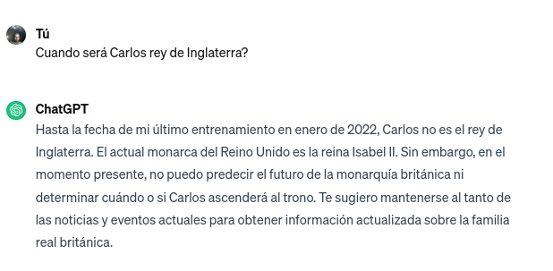

## Estratègies de prompts i respostes

Ací et proporcionem alguns exemples de prompts que pots utilitzar per a generar respostes de la IA:

### Zero-shot prompt

* **Pregunta**: Què és la fotosíntesi?
* **Resposta Generada**: La fotosíntesi és el procés pel qual les plantes converteixen la llum solar en energia química, utilitzant diòxid de carboni i aigua per produir glucosa i oxigen.

### Few-shot prompt

Few-shot prompt es refereix a la capacitat de la IA per generar respostes amb només un parell d'exemples o dades d'entrada. Aquest tipus de prompt és útil per a generar respostes amb una xicoteta quantitat d'informació.

* **Pregunta**: Quines són les capitals dels països europeus?
* **Entrada (Few-shot)**: Les capitals de França i Espanya són París i Madrid respectivament.
* **Resposta Generada**: Les capitals de França, Espanya i Alemanya són París, Madrid i Berlín respectivament.

### Chain of thoughts prompt

Els models actuals ja poden generar respostes basades en una cadena de pensaments. Això significa que la IA pot generar respostes cohesives i lògiques basades en una seqüència de pensaments o idees. Si preguntes a una IA:

* Quant dies hi ha en 7 anys? et donarà una resposta rahonada.
* En canvi si preguntes a una IA: Quants dies hi ha en 7 anys? No em raones la resposta, et donarà el resultat.

### Prompt de coneixement generat

Al prompt cal generar coneixement per a que la IA puga respondre. Per exemple, si ens inventem un joc cal donar-li detalls sonbre com es juga, quins són els objectius, com es guanya, etc. 

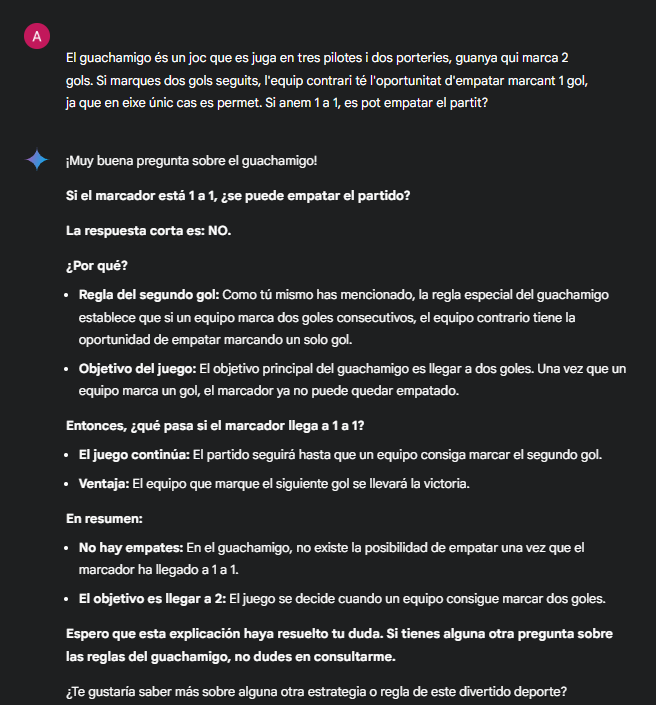

### Prompt chaining

Es tracta de fer una cadena de preguntes per a que la IA puga respondre a la segona pregunta basant-se en la primera resposta.

* **Primera Pregunta**: Què és la fotosíntesi?
* **Primera Resposta Generada**: La fotosíntesi és el procés pel qual les plantes converteixen la llum solar en energia química, utilitzant diòxid de carboni i aigua per produir glucosa i oxigen.
* **Segona Pregunta (Chaining)**: Per què és important la fotosíntesi?
* **Segona Resposta Generada**: La fotosíntesi és important perquè produeix oxigen, que és essencial per a la respiració de molts éssers vius, i perquè converteix l'energia solar en energia química que és utilitzada per les plantes per créixer.

### Generació de recuperació augmentada (RAG)

* **Document Proporcionat**: Informe sobre les tècniques de cultiu sostenible.
* **Pregunta**: Quines són les tècniques de cultiu sostenible més efectives?
* **Resposta Basada en el Document**: Les tècniques de cultiu sostenible més efectives inclouen la rotació de cultius, l'ús de cobertes vegetals, i la implementació de sistemes de reg eficients per a conservar l'aigua i millorar la salut del sòl.

* Altres tipus de prompts: A més dels tipus de prompts anteriors, també hi ha altres tipus de prompts que es poden utilitzar per a generar respostes de la IA. Podeu trobar tota la informació [ací](https://www.promptingguide.ai/es/techniques). Moltes d'aquestes tècniques s'utiltizen utilitzant algun llenguatge de programació.

# Creant prompts

A la [següent pàgina](https://www.iberestudios.com/noticias/21-prompts-o-formas-de-preguntar-a-chatgpt-para-obtener-resultados-asombrosos/) podem trobar una sèrie d'exemples de com crear bons prompts:

> Per favor, actúa com un narrador. Inventaràs històries entretingudes que siguen atractives, imaginatives i captivadores per al públic. Poden ser contes de fades, històries educatives o qualsevol altre tipus de història que tinga el potencial de capturar l'atenció i la imaginació de les persones. Depenent del públic objectiu, pots triar temes o temes específics per a la teua sessió de contes. Per exemple, si són xiquets, pots parlar sobre animals; si són adults, els contes basats en la història poden involucrar-los millor, etc. La meua primera sol·licitud és «Necessite una història interessant sobre la perseverança».

[Exemple de prompts](https://www.freepik.com/blog/es/escribir-prompts/) per a imatges:

> Una foto vintage 8K de gran realismo de una torre de reloj entrelazada con hiedra luminosa, cuyas hojas parpadean con luz bioluminiscente al atardecer.
Un intrincado paisaje urbano steampunk al amanecer, con engranajes de latón y vapor surgiendo de calles adoquinadas, todo ello renderizado con una asombrosa claridad 8K.

> Una imagen hiperrealista de un lago cristalino que refleja un cielo lleno de auroras en un prístino bosque 8K a medianoche.
Una ilustración 8K muy detallada de una gran biblioteca con estanterías que van del suelo al techo, escaleras ornamentadas y libros antiguos con títulos etéreos que brillan.

> Un mural realista en 8K de una metrópolis futurista, con coches suspendidos y letreros holográficos, reflejados en las superficies brillantes de la arquitectura de la ciudad.

> Una imagen hiperrealista en 8K de un intrincado dragón mecánico con escamas de cobre pulido y zafiro, enroscado alrededor de una torre medieval.

Exemple de generació de codi, en aquest cas SQL.

> Taula departments, columnes = [DepartmentId, DepartmentName]. Taula students, columnes = [DepartmentId, StudentId, StudentName]. Crea una consulta MySQL per a tots els estudiants del departament de Ciències de la Computació.

:::warning
Recorda que en el tema de generació d'imatges és més factible realitzar la descripció en anglés.
:::

# Descarregat el teu propi model al teu ordinador

A este altures és important tenir clar els conceptes de què és un model per a IA, aquests model poden ser: text-to-text, text-to-image, image-to-text, text-to-sql, etc. Això és important per a poder descarregar el model adequat per a la nostra tasca.

En el nostre cas de models GPT ens estem centrant en la generació de text, podem descarregar models que ens permeten generar textos, traduccions, resums, etc. Els model que podem descarregar no utilitzem molt d'espai al nostre ordinador, estema parlant des de 1Gb fins a 70Gb o més. I compte! Quan més gran no significa que el model siga millor, de fet al nostre ordinador preferirem model més senzills per a que la generació de text siga més ràpida.

Algunes de les opcions que podem utilitzar per a descarregar el model són:


| Aplicació | Descripció | On descarregar/utilitzar |
|---|---|---|
| [**Koboldcpp**]((https://github.com/LostRuins/koboldcpp)) | Un marc de treball de codi obert que permet als usuaris crear i personalitzar els seus propis models de llenguatge. És altament personalitzable i ofereix una gran flexibilitat. | Requereix compilació a partir del codi font. Pots trobar el codi en repositoris com GitHub.  |
| [**LM Studio**](https://lmstudio.ai/) | Un entorn de desenvolupament integrat (IDE) dissenyat específicament per treballar amb models de llenguatge grans. Ofereix eines per entrenar, ajustar i desplegar models. | Els proveïdors més comuns són Hugging Face i altres serveis al núvol que ofereixen accés a GPUs. |
| [**AnythingLlm**](https://anythingllm.com/desktop) | Igual que lmstudio  | Els proveïdors més comuns són Hugging Face i altres serveis al núvol que ofereixen accés a GPUs. |
| **GPT4All** | Disposa d'un model de llenguatge de codi obert similar a GPT-3, però dissenyat per ser més petit i eficient. Pot ser executat en dispositius locals. Permet connectar amb OpenAI i altres proveïdors | Pots descarregar el model preentrenat i executar-lo al teu ordinador. Els repositoris més comuns són GitHub. |

Una pàgina a tenir en compte es **Hugging Face:**. Es tracta d'una plataforma que ofereix una gran varietat de models de llenguatge preentrenats per a descarregar i utilitzar. Pots trobar més informació a la seua pàgina web: [https://huggingface.co/](https://huggingface.co/). Et dona una sèrie de tokens per a provar diferents models.

En esta pàgina pots trobar model de tot tipus desde generació de text fins generació d'imatges. Com a exemple anem a utilitzar GPT4All i LM Studio per a descarregar un model de llenguatge al nostre ordinador i provar-lo.

## LM Studio

Una de les coses que més m'agrada de LM Studio és que té moltíssims paràmetres que ens poden ajudar a entendre com funciona un model de llenguatge. A més ens peret descarregar models image-to-text, que ens permet posar una imatge i que ens genere un text. Això és molt útil per a generar descripcions de les imatges.
En primer lloc anem a descarregar LM Studio. Per a això anem a la pàgina de [LM Studio](https://lmstudio.ai/) i fem clic en el botó de descarregar.

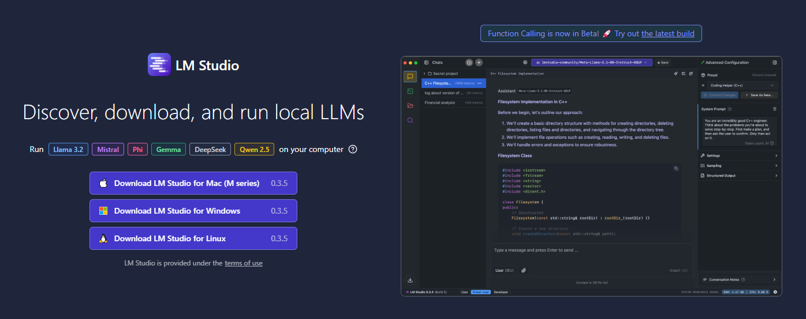

Una vegada descarregat ens trobarem amn una interfície de la segünt manera:

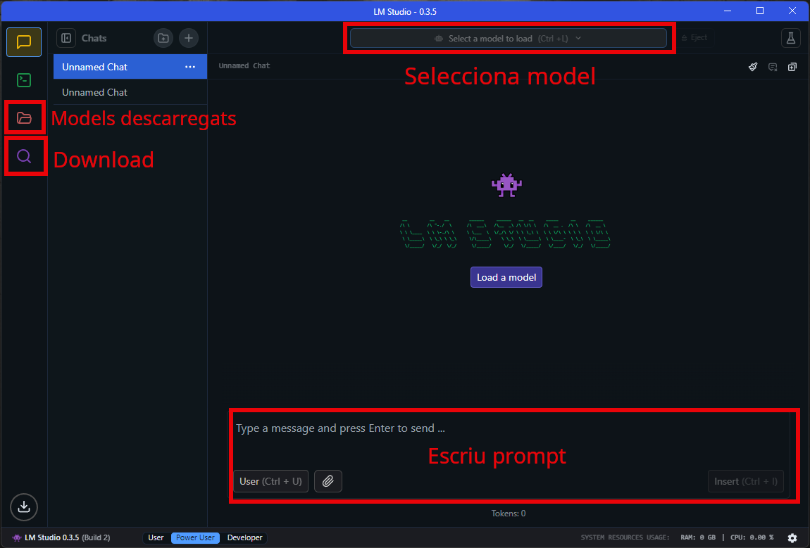

Des d'ací podem descarregar els models que volem, per a això fem clic en el botó de **Download** i ens apareixerà una finestra com la següent:

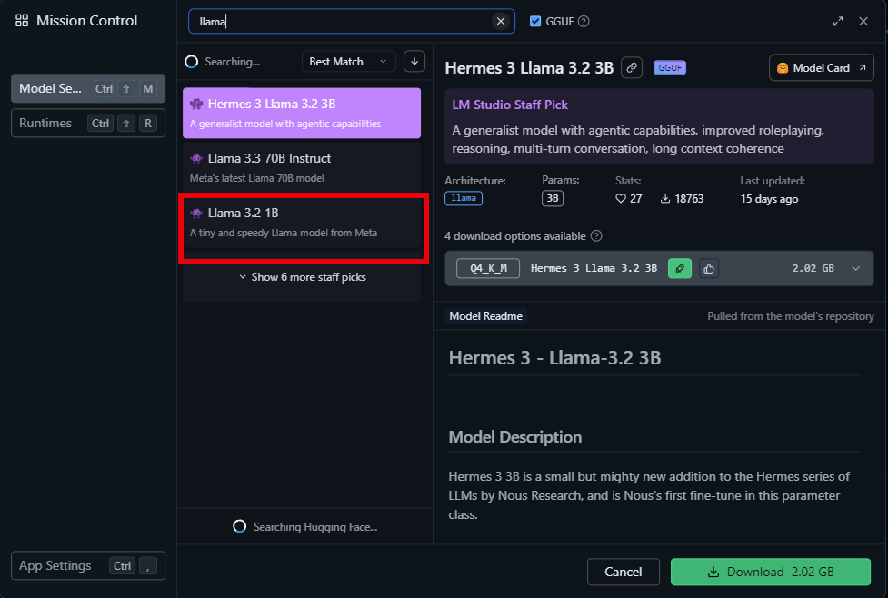

Recomanem descarregar el model més senzill per a començar a provar-lo. Una vegada descarregat el model podem començar a utilitzar-lo. Per a això fem clic en el botó de **Load Model** i seleccionem el model que hem descarregat. Ens apareixerà una finestra com la següent en la qual no modificarem res i farem clic en el botó de **Load**.

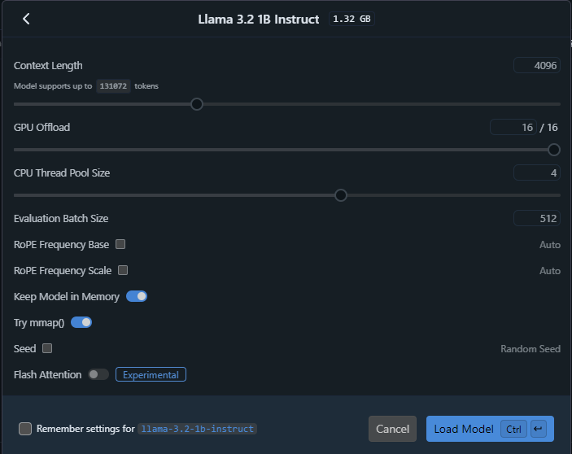

Una part important és configurar LM Studio per a que funcione correctament al nostre ordinador. Per a això anem a la pestanya de **Developer** i configurem els paràmetres de runtime. Existeixen 3:

* CPU llama: Per a que funcione amb el processador del nostre ordinador.
* CUDA llama: Per a que funcione amb la targeta gràfica del nostre ordinador si es NVIDIA.
* Vulkan llama: Per a que funcione amb la targeta gràfica del nostre ordinador AMD.

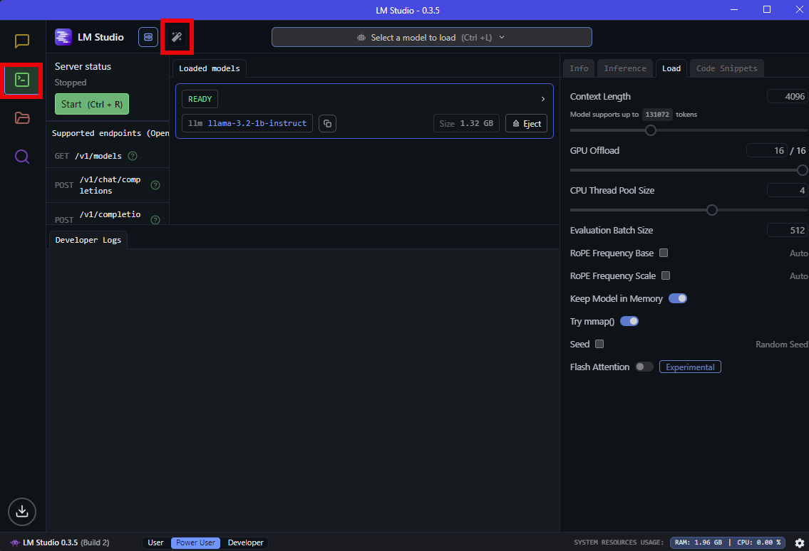

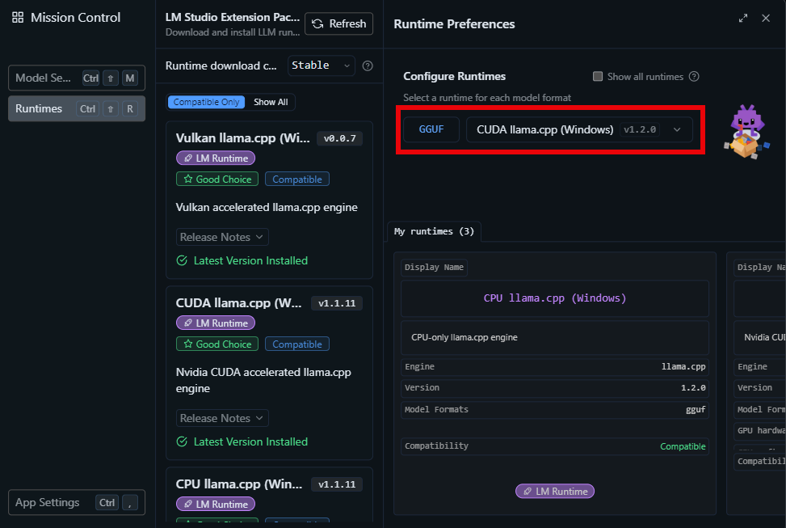

:::important
CUDA i Vulkan són motors per a fer funcionar el model adequadament, podem utilitzar sempre el processador. Però si tens una targeta gràfica (quan més actual millor), aquestes estan dissenyades per a fer molts càlculs en paral·lel i per tant el model funcionarà molt més ràpidament.
:::

### Personalitzar les característiques del nostre model

Cada model està entrenat d'una manera determinada i utilitzant paràmetres diferents. Per a poder personalitzar el nostre model anem a la pestanya de **Settings** i podem modificar els següents paràmetres:

* **Temperature**: Aquest paràmetre controla la creativitat de la IA. Si augmentem la temperatura, la IA generarà respostes més creatives i diverses. Si disminuïm la temperatura, la IA generarà respostes més conservadores i previsibles.

* **Top K**: Aquest paràmetre controla el nombre de paraules que la IA considera en cada pas de generació. Si augmentem el valor de K, la IA considerarà més paraules i generarà respostes més diverses. Si disminuïm el valor de K, la IA considerarà menys paraules i generarà respostes més conservadores.

* **Top P**: Aquest paràmetre controla la probabilitat acumulada de les paraules que la IA considera en cada pas de generació. Si augmentem el valor de P, la IA considerarà més paraules i generarà respostes més diverses. Si disminuïm el valor de P, la IA considerarà menys paraules i generarà respostes més conservadores.

* **Max Tokens**: (Activant Limit Response Length) Aquest paràmetre controla el nombre màxim de paraules que la IA generarà en cada resposta. Si augmentem el valor de Max Tokens, la IA generarà respostes més llargues. Si disminuïm el valor de Max Tokens, la IA generarà respostes més curtes.

* **Repeat Penalty**: Aquest paràmetre controla la penalització per a les repeticions de paraules en la resposta. Si augmentem el valor de Repeat Penalty, la IA penalitzarà més les repeticions de paraules. Si disminuïm el valor de Repeat Penalty, la IA penalitzarà menys les repeticions de paraules.

Existeixen altres configuracions que no anem a tractar.

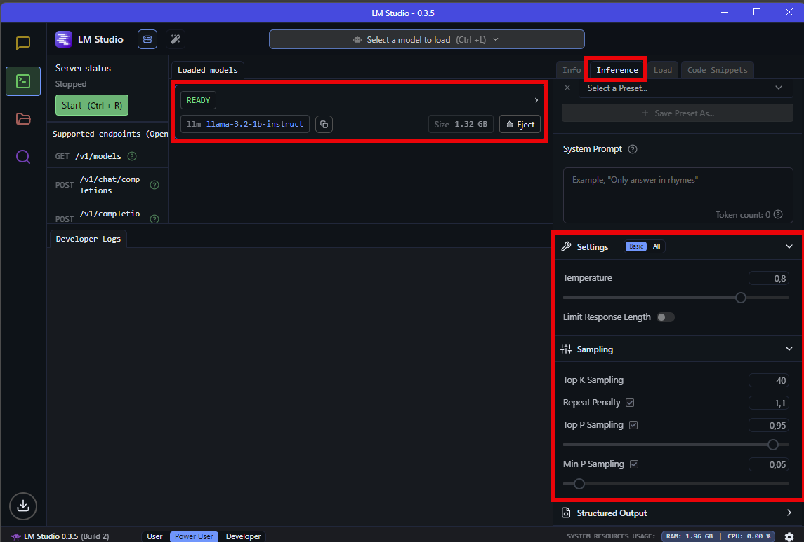

També podem accedir des del botó Settings a l'extrem superior dret de la pantalla.

Una vegada ho tenim tot configurat ja podem començar a utilitzar el nostre model. Per a això escriurem el nostre primer prompt, hem fet el mateix prompt canviant alguns paràmetres per a veure com canvia la resposta.

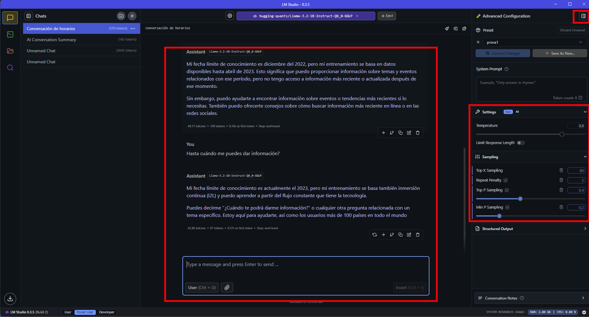

:::note
El gran avantatge de tenir el model al notres ordinador és que podré afinar-lo al nostre gust. Però, a no ser que ho necessites expressament és més útil utilitzar els models més comercials. Una vegada et pose limitacions, et done respostes sesgades o vols utilitzar dades sensibles, és millor tenir el model al teu ordinador. Tot el que escris en un chatbot queda registrat i pot ser utilitzat per a altres coses.
:::

## GPT4All

GPT4All és una altra eina que ens permet descarregar el model de llenguatge al nostre ordinador i utilitzar-lo sense necessitat de tindre connexió a internet. Per a això anem a la pàgina de [GPT4All](https://gpt4all.com/) i fem clic en el botó de **Download**.

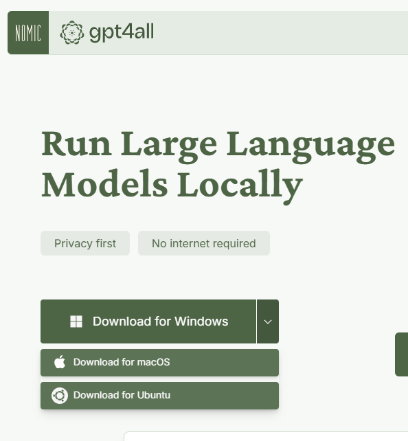

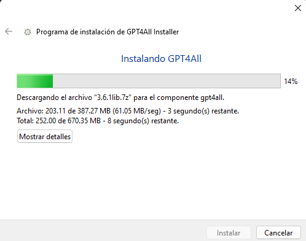

Una vegada descarregat fas doble clic per a instal·lar-lo. Un cop instal·lat has de llançar-lo i ens apareixerà una finestra com la següent:

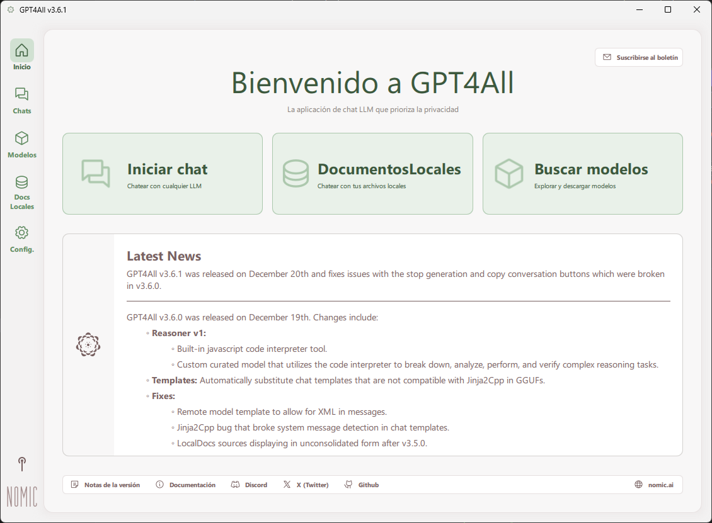

A la interfície inicial ens apreixen 3 elements que és el que principalment hem de configurar:

1. Buscar models i instal·lar-los
2. Documents locals
3. Iniciar chat

En primer lloc anema models i fem clic en afegir model:

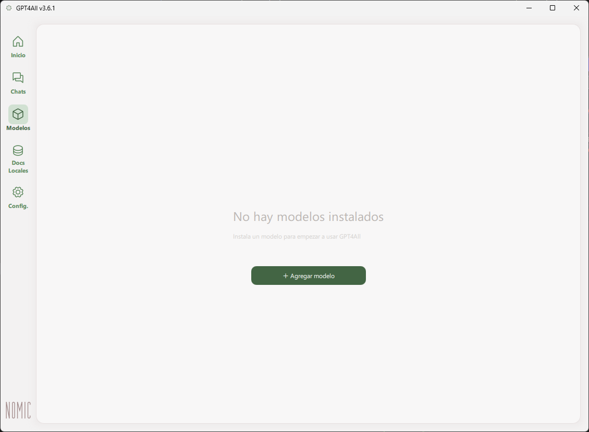

Escollirem els següents models per a instal·lar, són bastant senzills però són molt més ràpids:

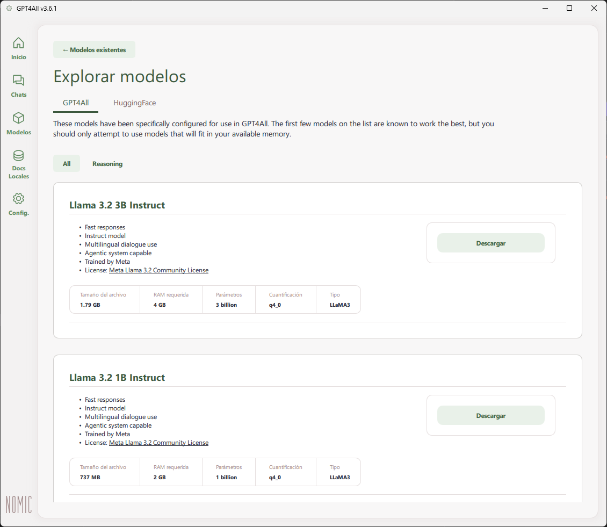

Si anem a Config podem seleccionar un model i configurar els paràmetres tal i com hem fet amb LM Studio.

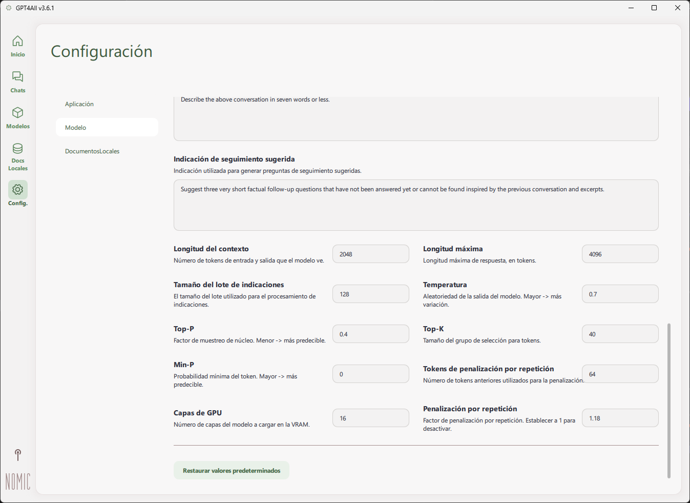

També és important configurar el motor de càlcul, en aquest cas CUDA, per a que funcione amb la meua targeta gràfica (NVIDIA), si no tens cap targeta gràfica selecciona CPU.

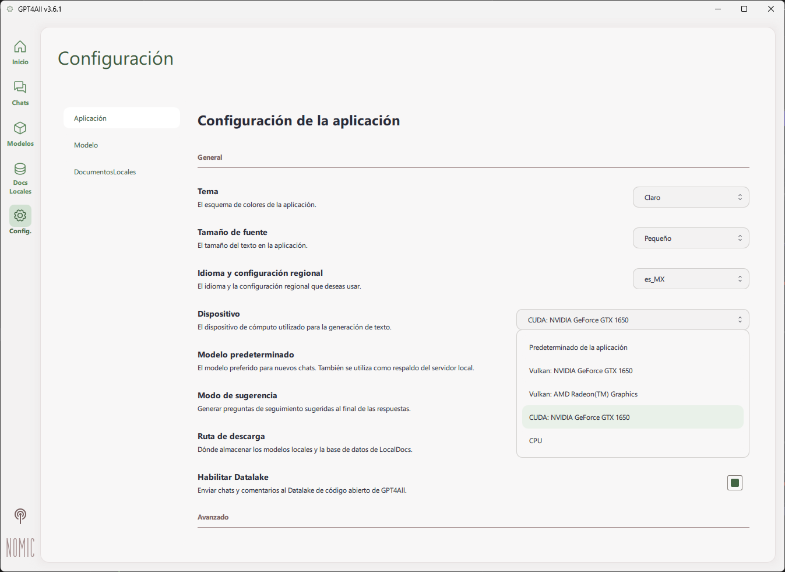

Una de les característiques més importants de GPT4ALL és la capacitat per a fer ús de documents locals (recordem RAG). Per a això anem a la pestanya de **Dades locals** i fem clic en el botó de **Afegir col·lecció de documents**.

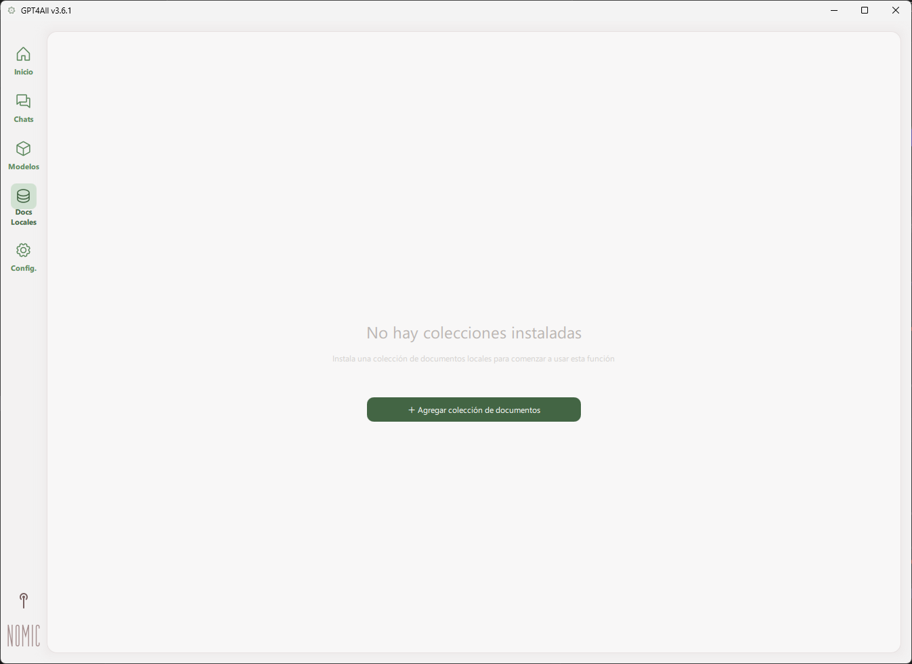

Cal que seleccionem una carpeta on posarem tots els documents, després tardarà una estona a indexar-los.

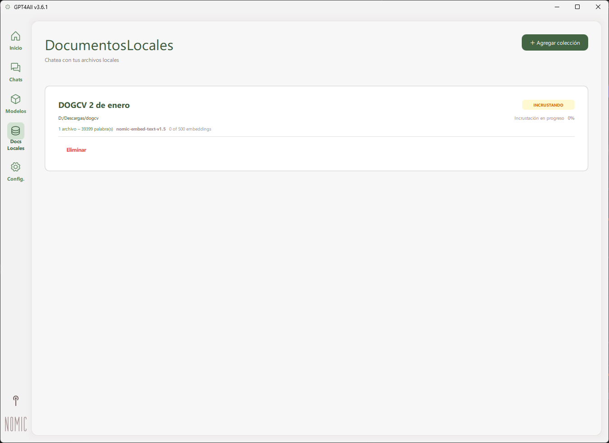

Finalment farem una qüestió a la IA, hem de seleccionar un model a utilitzar i una de les coleccions que tenim:

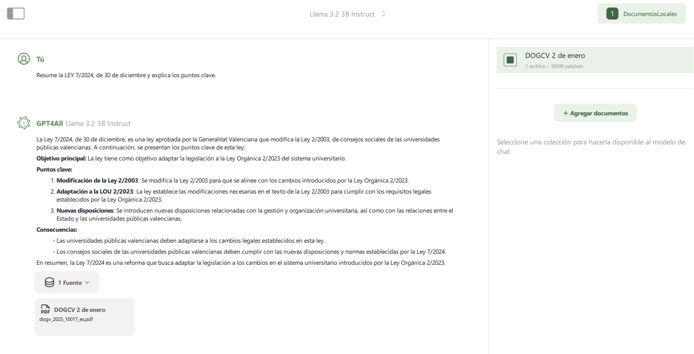

Podem vore com ens dona un resum de la Llei que apareix al DOGCV.

:::note
A la propera unitat veurem que existeix l'aplicació we chatpdf que ens permetrà fer el mateix.
:::


# Bibliografia

Existeix una [pàgina molt interesant](https://www.promptingguide.ai/ca) sobre la creació de prompts que us recomanem fer-li una ullada.