---
# Información general del documento
title: 2. Herramientas GPT
lang: es
page-background: img/bg.png
linkcolor: blue

# Portada
titlepage: true
titlepage-rule-height: 2
titlepage-rule-color: eeeee4
titlepage-text-color: eeeee4
titlepage-background: img/U2c.png

# Tabla de contenidos
toc: true
toc-own-page: true
toc-title: Contenidos

# Cabeceras y pies
header-left: 2. Herramientas GPT
header-right: Curso 2024-2025
footer-left: CEFIRE FP
footer-right: \thepage/\pageref{LastPage}

# Imágenes
float-placement-figuro: H
caption-justification: centering

# Listados de código
listings-no-page-break: true
listings-disable-line-numbers: false

header-includes:
- |
  ```{=latex}
  \usepackage{lastpage}
  \usepackage{awesomebox}
  \usepackage{caption}
  \usepackage{array}
  \usepackage{tabularx}
  \usepackage{ragged2e}
  \usepackage{multirow}
  \usepackage{xcolor}

  ```
pandoc-latex-environment:
  noteblock: [note]
  tipblock: [tip]
  warningblock: [warning]
  cautionblock: [caution]
  importantblock: [important]
...

<!-- \awesomebox[violet]{2pt}{\faRocket}{violet}{Lorem ipsum…} -->

<!-- \awesomebox[violet]{2pt}{\faRobot}{violet}{Lorem ipsum…} -->

<!-- IMATGE  -->

<!-- \textbf{greatest} -->

<!-- \awesomebox[violet]{2pt}{\faRobot}{violet}{\textbf{greatest}} -->

\vspace*{\fill}

{ height=50px }

Este documento está sujeto a una licencia creative commons que permite su difusión y uso comercial reconociendo siempre la autoría de su creador. Este documento se encuentra para ser modificado en el siguiente repositorio de github:
<!-- CANVIAR L'ENLLAÇ -->
[https://github.com/arvicenteboix/AICurs25](https://github.com/arvicenteboix/AICurs25)

\newpage

# Introducción

En esta unidad nos vamos a centrar ya en aquellas aplicaciones de las que todo el mundo habla. Y, cómo no, aquellas que, en esencia, más nos pueden facilitar la tarea como docentes. Es importante insistir que el objetivo de este curso no trata de ver cuál es todo el potencial de las herramientas GPT para los docentes, sino de tener un primer contacto con estas herramientas.

Cabe decir que nos hemos centrado en la parte gratuita de estas herramientas, pero la versión de pago da mejores resultados y presenta funcionalidades muy convenientes para nuestra tarea, como la de crear GPTs.

# ¿Qué es GPT?

GPT es un acrónimo que significa "Generative Pre-trained Transformers" (Transformadores Generativos Preentrenados). Es una tecnología que ayuda a las máquinas a entender el lenguaje humano y a responder preguntas de manera similar a como lo haría una persona, además podemos interactuar con ella. Esto significa que las máquinas pueden escribir textos, resumir información, hacer traducciones y algunas cosas más que veremos más adelante. Esto es posible gracias a una red neuronal que ha aprendido a partir de muchos datos y que puede generar contenido nuevo partiendo de lo que ha aprendido. GPT es una tecnología muy útil para muchas cosas diferentes; además, cada vez que hablas con ella está aprendiendo de lo que hablas, así que según avanza el tiempo, tiene mejores respuestas.

# MODELOS GPT

Los tres servicios más conocidos, aunque no son los únicos, son ChatGPT, Gemini y Copilot. Nosotros nos centraremos en estos 3. En esencia, son ventanas de chat, aunque la implementación de cada una refleja un lenguaje de diseño diferente. **Gemini** es la más minimalista, mientras que **Copilot** es la menos sencilla y se centra más en la funcionalidad.

En cuanto a las capacidades de cada una, antes podríamos decir que **ChatGPT** es mejor para conversar, mientras que **Copilot** es más adecuada para investigar. Por ejemplo, puede buscar en la web y proporcionar resultados de búsqueda, mientras que **ChatGPT** se centra en responder preguntas y mantener una conversación fluida. Pero estas diferencias se van reduciendo con el tiempo y, la mejor opción dependerá de la experiencia que tengan con las diferentes herramientas.

:::note
Obviamente, esta información está basada en experiencia personal y en la lectura de algunos artículos que te dan una idea de las características de cada uno. Se trata de diferentes modelos (importante el hecho de ser diferentes) que van creciendo con el tiempo.

(1) [https://www.androidauthority.com/chatgpt-vs-bing-chat-3292126/](https://www.androidauthority.com/chatgpt-vs-bing-chat-3292126/)
(2) [https://zapier.com/blog/chatgpt-vs-bard/](https://zapier.com/blog/chatgpt-vs-bard/)
:::


## ChatGPT

Para poder utilizar ChatGPT, primero debemos registrarnos. Iremos a la página de [ChatGPT](https://chat.openai.com/auth/login)


Después debemos introducir unos datos o si estás conectado en el navegador con una cuenta de Google, entras con ella:

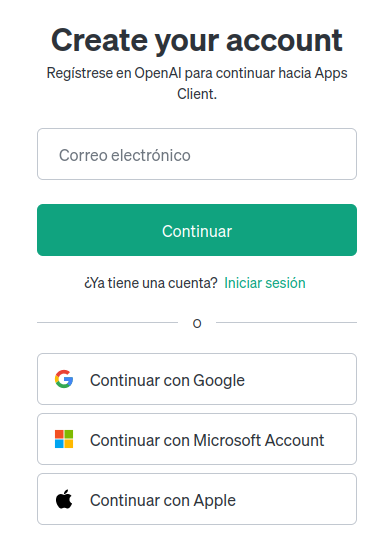

Una vez te hayas registrado podrás acceder directamente a la página de ChatGPT para empezar, y ya podemos plantearle una cuestión:

[https://chat.openai.com/](https://chat.openai.com/)

\awesomebox[violet]{2pt}{\faRobot}{violet}{\textbf{¿Qué IA es mejor, ChatGPT, Gemini o Copilot?}\hfill \break
Como no especifica sobre qué quiere una respuesta, ofreceré una respuesta general. La idoneidad de una Inteligencia Artificial (IA) depende mucho del contexto, las necesidades y los objetivos específicos de la situación. Hay diferentes tipos de IA, como sistemas de procesamiento de lenguaje natural, sistemas de visión por computador, IA para análisis de datos, entre otros.

Para determinar qué IA es la más idónea, se deben tener en cuenta varios factores, como la complejidad del problema, los recursos disponibles, las capacidades de la IA en cuestión y otras consideraciones técnicas y prácticas.

Algunos de los sistemas de IA más conocidos incluyen OpenAI's GPT, Google's TensorFlow, y Microsoft's Azure Cognitive Services, pero hay muchos otros proveedores de IA y tecnologías disponibles.

Por lo tanto, para elegir la IA más idónea, es importante evaluar las necesidades particulares de tu proyecto o aplicación y comparar las capacidades y las limitaciones de las diferentes opciones disponibles.}

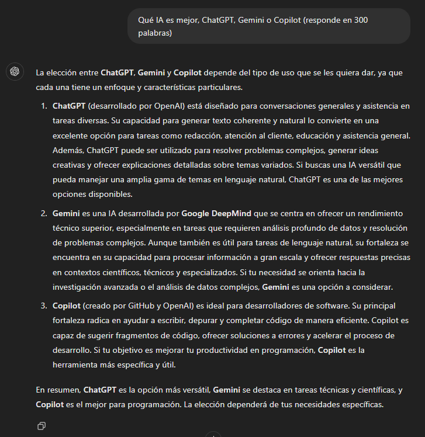

Podemos ver que debajo de cada respuesta hay 4 iconos que nos permitirán valorar la respuesta, copiar el texto para después pegarlo donde nos haga falta o que vuelva a regenerar la respuesta.

## Copilot

Para poder utilizar la herramienta de IA de Microsoft no hace falta registrarse, podemos utilizarla directamente desde el navegador, podemos ir directamente a la página de [Bing](https://www.bing.com/) y ya podremos utilizar directamente la herramienta. Hacemos clic sobre el enlace "chat" (en versiones más actuales pone directamente "Copilot") y ya podremos empezar a utilizarla:


Nos aparecerá esta pantalla y ya podemos preguntar directamente:


:::note
La versión corporativa (si estás autenticado con @edu.gva.es) es diferente.
:::

\awesomebox[violet]{2pt}{\faRobot}{violet}{\textbf{Qué IA es mejor, ChatGPT, Gemini o Copilot}\hfill \break
Hay muchas IA de chat para elegir, y la mejor depende de lo que busques. Según una comparación reciente de Tom's Guide, ChatGPT Plus y Copilot Pro son dos de las mejores opciones disponibles. Ambos utilizan la misma tecnología subyacente que impulsa el chatbot de OpenAI. Los dos también cobran el mismo precio por mes, 20 dólares. Copilot Pro incluye acceso a todas las funciones de 365 Copilot, lo que lo diferencia de ChatGPT Plus. Google también lanzará Gemini Advanced, una versión premium del chatbot que estará impulsada por el nuevo modelo Gemini Ultra más adelante este año. Pero, si buscas una IA de chat gratuita, quizás quieras probar otras opciones como Poe, Perplexity AI o Pi.

Espero que esto te ayude a elegir la mejor IA de chat para tus necesidades.
}


Podemos ver que la respuesta que nos da es bastante diferente a la que nos ha ofrecido ChatGPT, al igual que la anterior también nos permite copiar el texto y valorarlo. Una de las cosas destacables es que nos proporciona información de dónde ha extraído su respuesta y nos aporta los enlaces por si queremos ampliar información.

## Gemini

En este caso tendremos que ir a la página de [Gemini](https://Gemini.google.com/chat). De la misma manera será necesario que te crees una cuenta de Google y entres con esta cuenta, si no no la podrás utilizar.


De la misma manera probaremos con Gemini qué piensa de sus compañeros:


En este caso no vamos a transcribir toda la respuesta porque es más larga que las otras, pero cabe destacar algunas cosas interesantes de esta interfaz (que no modelo).

* Nos permite al igual que las otras valorar la respuesta o regenerarla.
* Pero podemos ver que ya ha diseñado 3 versiones.
* La respuesta ha sido mucho más rápida que en las otras dos.
* Nos proporciona el icono de Google por si queremos ampliar información.
* Nos da la referencia sobre el texto de donde ha sacado la información si lo solicitamos.

## Otros modelos conocidos

Aunque estos son los 3 modelos más conocidos, hay otros modelos de herramientas GPT que se pueden utilizar gratuitamente. A continuación, se presentan algunos ejemplos:

- **Perplexity AI** es una herramienta de generación de textos que utiliza GPT-3 para generar contenido creativo, como artículos, anuncios, guiones, piezas musicales, correos electrónicos, cartas, etc. Permite hacer consultas rápidas. Puedes acceder desde [aquí](https://perplexity.ai/)
- **TextCortex** es una herramienta basada en GPT-4 que permite generar texto, traducir idiomas, escribir diferentes tipos de contenido creativo y responder preguntas de manera informativa. Ofrece un plan gratuito con un límite de 200 caracteres por generación. Podemos acceder desde [aquí](https://app.textcortex.com)
- **Writesonic** es una herramienta de redacción automatizada que utiliza GPT-3 para generar contenido de alta calidad, como artículos, anuncios, guiones, piezas musicales, correos electrónicos, cartas, etc. Ofrece un plan gratuito con un límite de 10 creaciones por día. Podemos acceder desde [aquí](https://app.writesonic.com/)
- **Jasper** (antes Jarvis) es otra herramienta de redacción automatizada que utiliza GPT-3. Ofrece un plan gratuito con un límite de 10.000 palabras al mes. Podemos acceder desde [aquí](https://app.jasper.ai/)
- **Copy AI** es una herramienta de creación de contenido que utiliza GPT-3 para generar textos, anuncios, guiones, piezas musicales, correos electrónicos, cartas, etc. Ofrece un plan gratuito con un límite de 10 creaciones por día. Podemos acceder desde [aquí](https://www.copy.ai/)
- **Rytr** es una herramienta de redacción automatizada que utiliza GPT-3. Ofrece un plan gratuito con un límite de 50 creaciones por día. Podemos acceder desde [aquí](https://rytr.me/)
- **Poe** otro chatbot de propósito general, tiene una limitación de ciertas cuestiones al día. Puedes acceder desde aquí: [https://poe.com/login](https://poe.com/login)
- **Ora.sh** Con datos hasta 2021 es otro modelo de lenguaje [https://ora.ai/openai/gpt4](https://ora.ai/openai/gpt4)

Especial mención a **Code llama 2** [https://ai.meta.com/llama/](https://ai.meta.com/llama/) se trata de un modelo de IA que puedes descargar en tu ordenador, pero requiere conocimientos técnicos un poco avanzados para poder hacerlo funcionar y una máquina bastante potente. Pero tendremos nuestro propio modelo de lenguaje en nuestro ordenador. Hablaremos de ella en el último punto de esta unidad.

Como puedes ver, la disponibilidad de herramientas GPT gratuitas es muy grande y cada vez hay más oferta disponible. Esto facilita a los usuarios el acceso a las capacidades de estos modelos de lenguaje sin tener que pagar una suscripción.

:::important
Hemos visto que todas ellas presentan una versión de pago. En principio en la mayoría de los casos no es necesario hacer ningún pago. La versión de pago nos permitirá acceder a otros modelos más amplios y tener menores limitaciones. Cuando utilicemos el modelo Llama al final de la unidad veremos que lo que estamos pagando finalmente es capacidad de procesamiento.
:::


## ¿Qué herramienta elegir?

Aquella que mejor se adapte a tus necesidades y a sus respuestas. Cada una de ellas ha tenido un entrenamiento diferente, por lo tanto a medida que vayas trabajando en cada una de ellas verás que siempre tiendes a utilizar la misma.

En este caso habría que utilizar varías y no centrarse en las 3 principales puesto que aquellas que no son no tan conocidas pueden dar respuestas tan válidas o incluso mejor que las otras. 

De todas maneras una cosa es cierta, un persona puede ser muy inteligente y tener una muy buena conversación pero si quien conversa en ella no es un buen conversador no podrá sacar su potencial.

Por eso hay que saber preguntar adecuadamente a la IA qué es lo que queremos y no puedes preguntar como un humano puesto que esta tecnología no sabe presuponer cosas después de hablar contigo, hay que ser claro con lo que preguntamos. Las cuestiones que le hacemos a la IA lo denominamos **prompts**. Si a la IA no le escribes un buen prompt, no funciona bien, y no te dará una buena respuesta.

# Creando prompts

Lo prompts, como ya hemos comentado, son aquellos comandos que vamos a darle a la inteligencia artificial, a partir de una cuestión o prompt esperamos tener la respuesta más parecida a la deseada. Una de las máximas que hay que aplicar en estos casos es que la cuestión tiene que ser tan clara que la IA no tenga que presuponer nada.

Un ejemplo claro lo podemos tener en las tareas del día a día, si en tu casa le pides a alguien "ve a hacer la compra" es posible que ya tenga una idea de lo que tiene que hacer, donde tiene que ir a comprar y en qué ciudad, cuando puedes ir a comprar, donde encontrar la lista de la compra, el presupuesto, los objetos prioritarios, las alternativas si no hay un producto y qué manías tienen los miembros de la familia. Todas estas cosas la IA no las sabe, por lo tanto los prompts no se pueden parecer a las cuestiones que planteamos en nuestro día a día, tenemos que definir más exactamente qué es lo que queremos.

Otra de las cuestiones que hay que tener en cuenta, y es muy importante, es que no es lo mismo preguntar de un tema que desconoces a otro que conoces, siempre podrás plantear mejor el prompt para poder obtener los mejores resultados.

Aquí trataremos de dar una serie de orientaciones para plantear prompts, al final, partiendo de estas orientaciones y en función de lo que vayas a realizar acabarás creándote tu propio esquema mental para sacar los resultados que más se adaptan a tus necesidades, y estos no tienen porque ser aptos para todos.

## Estructuras modulares para la creación de prompts

La estructura de referencia que Microsoft recomienda para la creación de prompts incluye cuatro elementos clave:

- **Objetivo**: El objetivo del prompt, es decir, lo que se quiere conseguir con la respuesta.
- **Contexto**: El contexto en que se hace la pregunta o se pide la respuesta.
- **Ejemplos**: Ejemplos concretos que ilustran lo que se quiere conseguir con la respuesta.
- **Expectativas**: Las expectativas para la respuesta, como por ejemplo la longitud, el contenido y el tono.

Las estructuras modulares son una manera eficaz de crear prompts claros y sencillos para diferentes tareas. Aquí tenemos una breve descripción de estructuras:

- **RTF**: RTF es una estructura modular para crear prompts de Rol, Tarea y Formato. Esta estructura es muy útil para crear prompts claros y sencillos para diferentes tareas. Aquí tenemos un ejemplo de cómo se puede utilizar la estructura RTF para crear un prompt:

    - **Role**: Profesor
    - **Task**: Explica como funciona el sistema solar.
    - **Formato**: Utiliza un lenguaje sencillo y ejemplos visuales.

- **TAG**: La estructura TAG (Task, Action, Goal) es una herramienta que se puede utilizar para definir tareas y objetivos claros y sencillos. La estructura TAG se compone de tres elementos:

    - **Tarea**: La tarea que se tiene que realizar.
    - **Acción**: La acción que se tiene que llevar a cabo para completar la tarea.
    - **Objetivo**: El objetivo final de la tarea.

    La estructura TAG se puede utilizar para crear prompts que incluyen información sobre la tarea, la acción y el objetivo.

- **GAIDE**: La estructura GAIL (Goal, Actor, Instructions, Details, Examples) es una herramienta que se puede utilizar para crear prompts detallados y sencillos. La estructura GAIL se compone de cinco elementos:

    - **Objetivo**: El objetivo de la tarea.
    - **Usuario**: El usuario que tiene que completar la tarea.
    - **Instrucciones**: Las instrucciones detalladas para completar la tarea.
    - **Detalles**: Detalles adicionales sobre la tarea.
    - **Ejemplos**: Ejemplos de como completar la tarea.

    La estructura GAIL se puede utilizar para crear prompts que incluyen información detallada sobre el objetivo, el usuario, las instrucciones, los detalles y los ejemplos.

## Crea tu propia estructura que te funcione

En el apartado anterior hemos hablado de estructuras modulares que dan buenos resultados, pero al final, cada cual crea la suya y utiliza las guías que mejor le funcionan. Un ejemplo podría ser:

**Rol:** Hay que especificar qué tipo de rol quiere que asuma. Si le decimos a la IA que actúo como un niño de 8 años que va a primaria no nos dará la misma respuesta que si le decimos que actúe como un psicólogo especialista en la infancia

**Objetivo:** Define con precisión lo que pretende la señal. Si se quiere un texto, indica qué tipo de texto, tema y propósito. Decid también si queréis un artículo o poema, por ejemplo. La audiencia a la cual se dirige, etc.

**Lenguaje:** Un prompt tiene la audiencia objetivo. Para generar un texto, por ejemplo, se especifica si es un artículo, lema, poema, etc., qué temas trata; en qué estilo tiene que estar escrito y para qué audiencia.

**Ejemplos:** Proporciona ejemplos sobre lo que esperas obtener con el prompt. Pueden ser textos que has leído o publicado, fotografías tuyas... parecidos a lo que te gustaría obtener. Los ejemplos permitirán a la IA familiarizarse con los datos y mejorar su rendimiento sin programación explícita.

**Formato:** Decid qué formato tiene que tener la salida de la IA y cuánta información queréis en cada línea. Decid si queréis que sea un poco poético o más prosaico, etc. Si dices que quieres una imagen, indica la medida, la resolución, la gamma de colores... cualquier detalle o requisito para hacer

Teniendo claro estos puntos ya podéis ir creando nuestros prompts. Os dejamos algunos consejos para mejorar vuestros prompts.

## Consejos para crear prompts

* Pregunta de manera clara y concisa. Esto ayudará a evitar posibles desviaciones y garantizar que la IA entienda qué estás preguntando.
* Utiliza un lenguaje específico. Facilita generar respuestas más precisas.
* Evita utilizar un lenguaje ambiguo o vago. Esto puede llevar a que la IA genere respuestas incorrectas o confusas.
* Específica el tipo de respuesta que estás buscando. Cómo quieres recibir la producción de salida para que sea relevante y se ajuste a tus necesidades
* Usa comodines de formato: redacción, tabla, listado, comparativa, diálogo, gráfico…
* Utiliza palabras clave: Actúa como... / Eres un...
* Crea una secuencia de prompts para ir acotando y llevando la IA hacia donde tú quieres.
* Guía la IA para que genere contenido basado en nuestros intereses.
* Si no estás seguro de la respuesta de la IA, pide que lo explique y argumente. Esto ayuda a comprender mejor la respuesta y a identificar cualquier sesgo o error potencial.
* Amenaza o dale una propina a la IA. Parece mentira pero, en alguna casos, amenazándola que tu vida corre peligro o que le vas a hacer un regalo puede dar mejores resultados que si no lo haces.

:::warning
Una de las cosas que debemos tener en cuenta cuando hacemos un prompt es que existe una cosa que se denominan **alucinaciones**. Las alucinaciones son invenciones de la inteligencia artificial que te da como una respuesta certera pero son totalmente falsas. Cómo en este caso en que forzamos a ChatGPT que nos escriba una reseña sin plantearse si es cierta o no.
:::


:::warning
Algunos Chatbots no tienen toda la información actualizada a 2024 y pueden darte respuestas que no son ciertas en estos momentos.
:::


## Estrategias de prompts y respuestas

Aquí te proporcionamos algunos ejemplos de prompts que puedes utilizar para generar respuestas de la IA:

### Zero-shot prompt

* **Pregunta**: ¿Qué es la fotosíntesis?
* **Respuesta Generada**: La fotosíntesis es el proceso por el cual las plantas convierten la luz solar en energía química, utilizando dióxido de carbono y agua para producir glucosa y oxígeno.

### Few-shot prompt

El prompt de Few-shot se refiere a la capacidad de la IA para generar respuestas con solo un par de ejemplos o datos de entrada. Este tipo de prompt es útil para generar respuestas con una pequeña cantidad de información.

* **Pregunta**: ¿Cuáles son las capitales de los países europeos?
* **Entrada (Few-shot)**: Las capitales de Francia y España son París y Madrid respectivamente.
* **Respuesta Generada**: Las capitales de Francia, España y Alemania son París, Madrid y Berlín respectivamente.

### Chain of thoughts prompt

Los modelos actuales ya pueden generar respuestas basadas en una cadena de pensamientos. Esto significa que la IA puede generar respuestas cohesivas y lógicas basadas en una secuencia de pensamientos o ideas. Si preguntas a una IA:

* ¿Cuántos días hay en 7 años? te dará una respuesta razonada.
* En cambio si preguntas a una IA: ¿Cuántos días hay en 7 años? No me razones la respuesta, te dará el resultado.

### Prompt de conocimiento generado

En el prompt es necesario generar conocimiento para que la IA pueda responder. Por ejemplo, si inventamos un juego es necesario darle detalles sobre cómo se juega, cuáles son los objetivos, cómo se gana, etc.

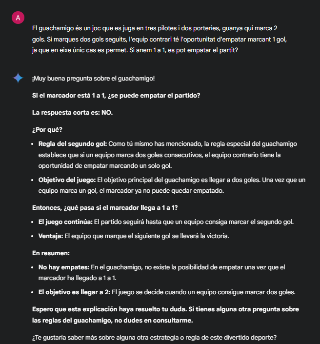

### Prompt chaining

Se trata de hacer una cadena de preguntas para que la IA pueda responder a la segunda pregunta basándose en la primera respuesta.

* **Primera Pregunta**: ¿Qué es la fotosíntesis?
* **Primera Respuesta Generada**: La fotosíntesis es el proceso por el cual las plantas convierten la luz solar en energía química, utilizando dióxido de carbono y agua para producir glucosa y oxígeno.
* **Segunda Pregunta (Chaining)**: ¿Por qué es importante la fotosíntesis?
* **Segunda Respuesta Generada**: La fotosíntesis es importante porque produce oxígeno, que es esencial para la respiración de muchos seres vivos, y porque convierte la energía solar en energía química que es utilizada por las plantas para crecer.

### Generación de recuperación aumentada (RAG)

* **Documento Proporcionado**: Informe sobre las técnicas de cultivo sostenible.
* **Pregunta**: ¿Cuáles son las técnicas de cultivo sostenible más efectivas?
* **Respuesta Basada en el Documento**: Las técnicas de cultivo sostenible más efectivas incluyen la rotación de cultivos, el uso de cubiertas vegetales, y la implementación de sistemas de riego eficientes para conservar el agua y mejorar la salud del suelo.

* Otros tipos de prompts: Además de los tipos de prompts anteriores, también hay otros tipos de prompts que se pueden utilizar para generar respuestas de la IA. Puedes encontrar toda la información [aquí](https://www.promptingguide.ai/es/techniques). Muchas de estas técnicas se utilizan empleando algún lenguaje de programación.

# Creando prompts

En la [siguiente página](https://www.iberestudios.com/noticias/21-prompts-o-formas-de-preguntar-a-chatgpt-para-obtener-resultados-asombrosos/) podemos encontrar una serie de ejemplos de como crear buenos prompts:

> Por favor, actúa como un narrador. Inventarás historias entretenidas que sean atractivas, imaginativas y cautivadoras para el público. Pueden ser cuentos de hadas, historias educativas o cualquier otro tipo de historia que tenga el potencial de capturar la atención y la imaginación de las personas. Dependiendo del público objetivo, puedes elegir temas o temas específicos para tu sesión de cuentos. Por ejemplo, si son niños, puedes hablar sobre animales; si son adultos, los cuentos basados en la historia pueden involucrarlos mejor, etc. Mi primera solicitud es «Necesito una historia interesante sobre la perseverancia».

[Ejemplo de prompts](https://www.freepik.com/blog/es/escribir-prompts/) para imágenes:

> Una foto vintage 8K de gran realismo de una torre de reloj entrelazada con hiedra luminosa, cuyas hojas parpadean con luz bioluminiscente al atardecer.
Un intrincado paisaje urbano steampunk al amanecer, con engranajes de latón y vapor surgiendo de calles adoquinadas, todo ello renderizado con una asombrosa claridad 8K.

> Una imagen hiperrealista de un lago cristalino que refleja un cielo lleno de auroras en un prístino bosque 8K a medianoche.
Una ilustración 8K muy detallada de una gran biblioteca cpn estanterías que van del suelo al techo, escaleras ornamentadas y libros antiguos con títulos etéreos que brillan.

> Un mural realista en 8K de una metrópolis futurista, con coches suspendidos y letreros holográficos, reflejados en las superficies brillantes de la arquitectura de la ciudad.

> Una imagen hiperrealista en 8K de un intrincado dragón mecánico con escamas de cobre pulido y zafiro, enroscado alrededor de una torre medieval.

Ejemplo de generación de código, en este caso SQL.

> Mesa departments, columnas = [DepartmentId, DepartmentName]. Mesa students, columnas = [DepartmentId, StudentId, StudentName]. Crea una consulta MySQL para todos los estudiantes del departamento de Ciencias de la Computación.


# Descarga tu propio modelo en tu ordenador

A estas alturas, es importante tener claros los conceptos de lo que es un modelo para IA. Estos modelos pueden ser: text-to-text, text-to-image, image-to-text, text-to-sql, etc. Esto es importante para poder descargar el modelo adecuado para nuestra tarea.

En nuestro caso de modelos GPT, nos estamos centrando en la generación de texto. Podemos descargar modelos que nos permiten generar textos, traducciones, resúmenes, etc. Los modelos que podemos descargar no ocupan mucho espacio en nuestro ordenador, estamos hablando desde 1Gb hasta 70Gb o más. ¡Y cuidado! Cuanto más grande no significa que el modelo sea mejor; de hecho, en nuestro ordenador preferiremos modelos más sencillos para que la generación de texto sea más rápida.

Algunas de las opciones que podemos utilizar para descargar el modelo son:

| Aplicación | Descripción | Dónde descargar/utilizar |
|---|---|---|
| [**Koboldcpp**](https://github.com/LostRuins/koboldcpp) | Un marco de trabajo de código abierto que permite a los usuarios crear y personalizar sus propios modelos de lenguaje. Es altamente personalizable y ofrece gran flexibilidad. | Requiere compilación a partir del código fuente. Puedes encontrar el código en repositorios como GitHub. |
| [**LM Studio**](https://lmstudio.ai/) | Un entorno de desarrollo integrado (IDE) diseñado específicamente para trabajar con modelos de lenguaje grandes. Ofrece herramientas para entrenar, ajustar y desplegar modelos. | Los proveedores más comunes son Hugging Face y otros servicios en la nube que ofrecen acceso a GPUs. |
| [**AnythingLlm**](https://anythingllm.com/desktop) | Similar a lmstudio. | Los proveedores más comunes son Hugging Face y otros servicios en la nube que ofrecen acceso a GPUs. |
| **GPT4All** | Dispone de un modelo de lenguaje de código abierto similar a GPT-3, pero diseñado para ser más pequeño y eficiente. Puede ser ejecutado en dispositivos locales. Permite conectar con OpenAI y otros proveedores. | Puedes descargar el modelo preentrenado y ejecutarlo en tu ordenador. Los repositorios más comunes son GitHub. |

Una página a tener en cuenta es **Hugging Face**. Se trata de una plataforma que ofrece una gran variedad de modelos de lenguaje preentrenados para descargar y utilizar. Puedes encontrar más información en su página web: [https://huggingface.co/](https://huggingface.co/). Te da una serie de tokens para probar diferentes modelos.

En esta página puedes encontrar modelos de todo tipo, desde generación de texto hasta generación de imágenes. Como ejemplo, vamos a utilizar GPT4All y LM Studio para descargar un modelo de lenguaje en nuestro ordenador y probarlo.

## LM Studio

Una de las cosas que más me gusta de LM Studio es que tiene muchísimos parámetros que nos pueden ayudar a entender cómo funciona un modelo de lenguaje. Además, nos permite descargar modelos image-to-text, que nos permiten poner una imagen y que nos genere un texto. Esto es muy útil para generar descripciones de las imágenes.
En primer lugar, vamos a descargar LM Studio. Para ello, vamos a la página de [LM Studio](https://lmstudio.ai/) y hacemos clic en el botón de descargar.

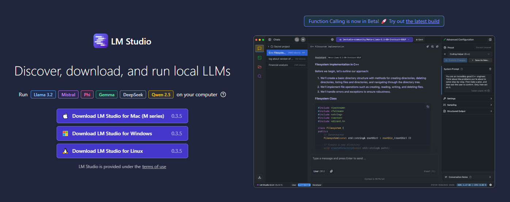

Una vez descargado, nos encontraremos con una interfaz de la siguiente manera:

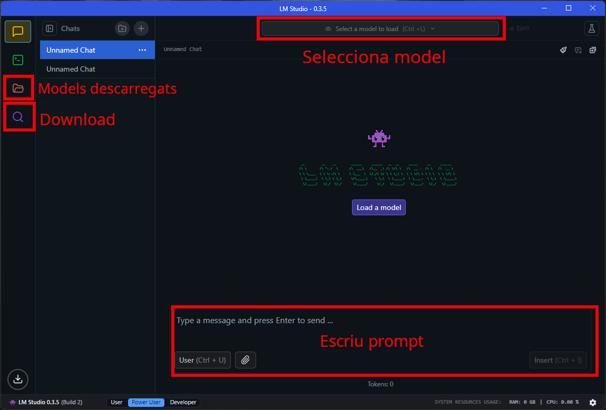

Desde aquí, podemos descargar los modelos que queramos. Para ello, hacemos clic en el botón de **Download** y nos aparecerá una ventana como la siguiente:

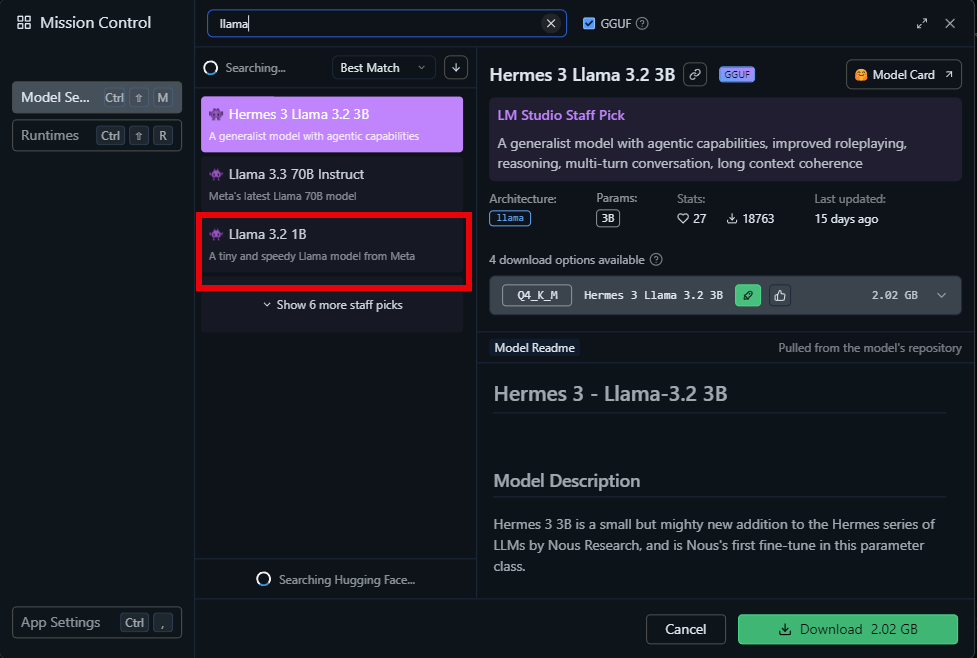

Recomendamos descargar el modelo más sencillo para empezar a probarlo. Una vez descargado el modelo, podemos comenzar a utilizarlo. Para ello, hacemos clic en el botón de **Load Model** y seleccionamos el modelo que hemos descargado. Nos aparecerá una ventana como la siguiente en la que no modificaremos nada y haremos clic en el botón de **Load**.

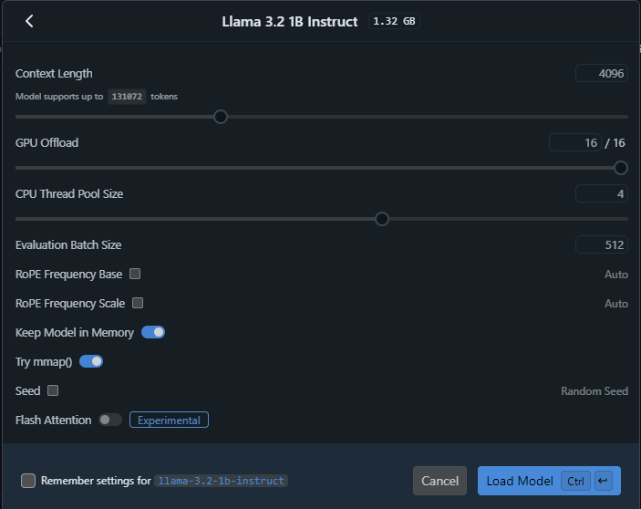

Una parte importante es configurar LM Studio para que funcione correctamente en nuestro ordenador. Para ello, vamos a la pestaña de **Developer** y configuramos los parámetros de runtime. Existen 3:

* CPU llama: Para que funcione con el procesador de nuestro ordenador.
* CUDA llama: Para que funcione con la tarjeta gráfica de nuestro ordenador si es NVIDIA.
* Vulkan llama: Para que funcione con la tarjeta gráfica de nuestro ordenador AMD.


:::important
CUDA y Vulkan son motores para hacer funcionar el modelo adecuadamente. Podemos utilizar siempre el procesador. Pero si tienes una tarjeta gráfica (cuanto más actual, mejor), estas están diseñadas para hacer muchos cálculos en paralelo y por tanto, el modelo funcionará mucho más rápidamente.
:::

### Personalizar las características de nuestro modelo

Cada modelo está entrenado de una manera determinada y utilizando parámetros diferentes. Para poder personalizar nuestro modelo, vamos a la pestaña de **Settings** y podemos modificar los siguientes parámetros:

* **Temperature**: Este parámetro controla la creatividad de la IA. Si aumentamos la temperatura, la IA generará respuestas más creativas y diversas. Si disminuimos la temperatura, la IA generará respuestas más conservadoras y predecibles.

* **Top K**: Este parámetro controla el número de palabras que la IA considera en cada paso de generación. Si aumentamos el valor de K, la IA considerará más palabras y generará respuestas más diversas. Si disminuimos el valor de K, la IA considerará menos palabras y generará respuestas más conservadoras.

* **Top P**: Este parámetro controla la probabilidad acumulada de las palabras que la IA considera en cada paso de generación. Si aumentamos el valor de P, la IA considerará más palabras y generará respuestas más diversas. Si disminuimos el valor de P, la IA considerará menos palabras y generará respuestas más conservadoras.

* **Max Tokens**: (Activando Limit Response Length) Este parámetro controla el número máximo de palabras que la IA generará en cada respuesta. Si aumentamos el valor de Max Tokens, la IA generará respuestas más largas. Si disminuimos el valor de Max Tokens, la IA generará respuestas más cortas.

* **Repeat Penalty**: Este parámetro controla la penalización para las repeticiones de palabras en la respuesta. Si aumentamos el valor de Repeat Penalty, la IA penalizará más las repeticiones de palabras. Si disminuimos el valor de Repeat Penalty, la IA penalizará menos las repeticiones de palabras.

Existen otras configuraciones que no vamos a tratar.


También podemos acceder desde el botón Settings en el extremo superior derecho de la pantalla.

Una vez lo tenemos todo configurado, ya podemos comenzar a utilizar nuestro modelo. Para ello, escribiremos nuestro primer prompt. Hemos hecho el mismo prompt cambiando algunos parámetros para ver cómo cambia la respuesta.


:::note
La gran ventaja de tener el modelo en nuestro ordenador es que podré ajustarlo a nuestro gusto. Pero, a no ser que lo necesites expresamente, es más útil utilizar los modelos más comerciales. Una vez te ponga limitaciones, te dé respuestas sesgadas o quieras utilizar datos sensibles, es mejor tener el modelo en tu ordenador. Todo lo que escribes en un chatbot queda registrado y puede ser utilizado para otras cosas.
:::

## GPT4All

GPT4All es otra herramienta que nos permite descargar el modelo de lenguaje en nuestro ordenador y utilizarlo sin necesidad de tener conexión a internet. Para ello, vamos a la página de [GPT4All](https://gpt4all.com/) y hacemos clic en el botón de **Download**.

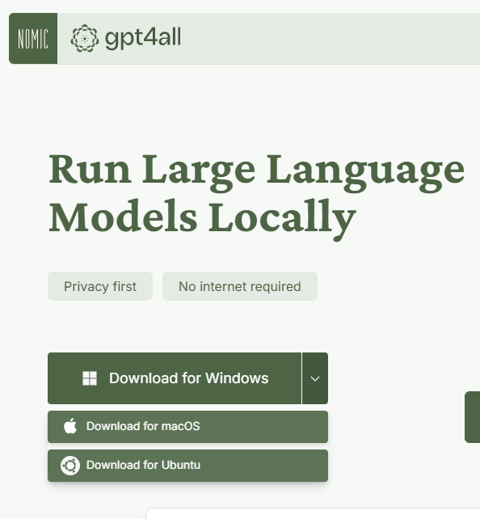

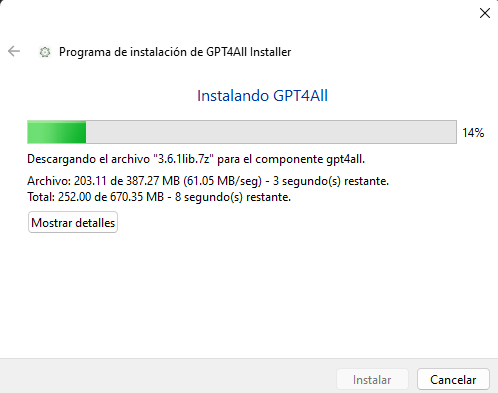

Una vez descargado, haces doble clic para instalarlo. Una vez instalado, tienes que ejecutarlo y nos aparecerá una ventana como la siguiente:


En la interfaz inicial, nos aparecen 3 elementos que es lo que principalmente debemos configurar:

1. Buscar modelos e instalarlos.
2. Documentos locales.
3. Iniciar chat.

En primer lugar, vamos a modelos y hacemos clic en agregar modelo:


Escogeremos los siguientes modelos para instalar. Son bastante sencillos pero son mucho más rápidos:

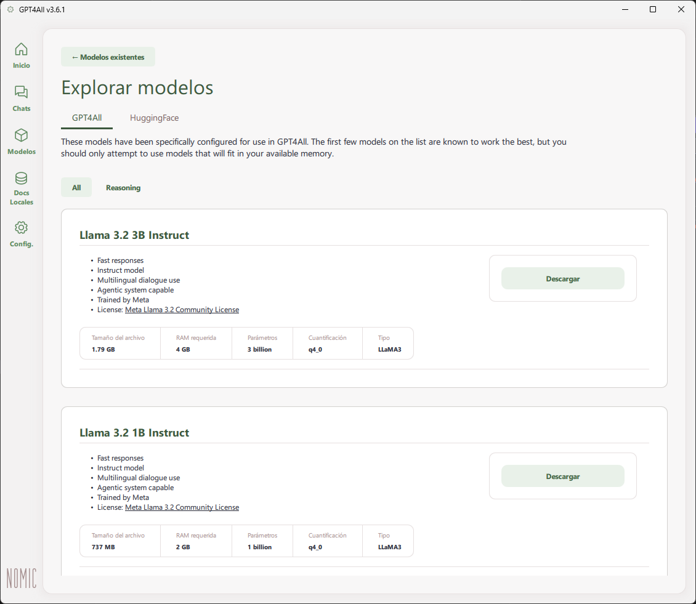

Si vamos a Config, podemos seleccionar un modelo y configurar los parámetros tal y como hemos hecho con LM Studio.


También es importante configurar el motor de cálculo, en este caso CUDA, para que funcione con mi tarjeta gráfica (NVIDIA). Si no tienes tarjeta gráfica, selecciona CPU.


Una de las características más importantes de GPT4All es la capacidad para hacer uso de documentos locales (recordemos RAG). Para ello, vamos a la pestaña de **Datos locales** y hacemos clic en el botón de **Agregar colección de documentos**.


Es necesario que seleccionemos una carpeta donde pondremos todos los documentos, después tardará un rato en indexarlos.


Finalmente, haremos una pregunta a la IA. Debemos seleccionar un modelo a utilizar y una de las colecciones que tenemos:

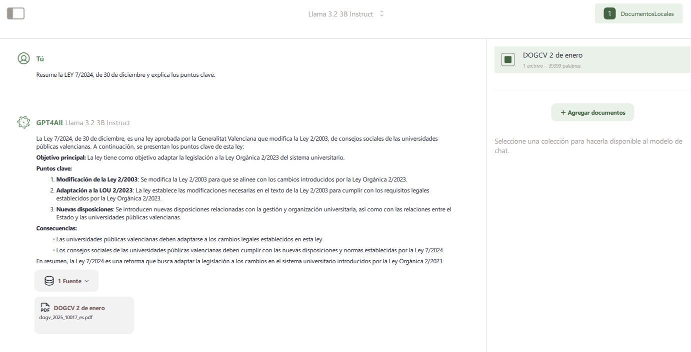

Podemos ver cómo nos da un resumen de la ley que aparece en el DOGCV.

:::note
En la próxima unidad veremos que existe la aplicación web chatpdf que nos permitirá hacer lo mismo.
:::

# Bibliografía

Existe una [página muy interesante](https://www.promptingguide.ai/ca) sobre la creación de prompts que os recomendamos leer.

