---
# Informació general del document
title: 3. Creació multimèdia amb IA
lang: ca
page-background: img/bg.png
colorlinks: true

# Portada
titlepage: true
titlepage-rule-height: 2
titlepage-rule-color: eeeee4
titlepage-text-color: eeeee4
titlepage-background: img/U3v.png

# Taula de continguts
toc: true
toc-own-page: true
toc-title: Continguts

# Capçaleres i peus
header-left: 3. Creació multimèdia amb IA
header-right: Curs 2024-2025
footer-left: CEFIRE FP
footer-right: \thepage/\pageref{LastPage}

# Imatges
float-placement-figure: H
caption-justification: centering

# Llistats de codi
listings-no-page-break: true
listings-disable-line-numbers: false

header-includes:
- |
  ```{=latex}
  \usepackage{lastpage}
  \usepackage{awesomebox}
  \usepackage{caption}
  \usepackage{array}
  \usepackage{tabularx}
  \usepackage{ragged2e}
  \usepackage{multirow}
  \usepackage{xcolor}

  ```
pandoc-latex-environment:
  noteblock: [note]
  tipblock: [tip]
  warningblock: [warning]
  cautionblock: [caution]
  importantblock: [important]
...

<!-- \awesomebox[violet]{2pt}{\faRocket}{violet}{Lorem ipsum…} -->

<!-- \awesomebox[violet]{2pt}{\faRobot}{violet}{Lorem ipsum…} -->

<!-- IMATGE { width=10cm } -->

<!-- \textbf{greatest} -->

<!-- \awesomebox[violet]{2pt}{\faRobot}{violet}{\textbf{greatest}\hfill \break} -->

\vspace*{\fill}

{ height=50px }

Aquest document està subjecte a una llicència creative commons que permet la seua difusió i ús comercial reconeixent sempre l'autoria del seu creador. Aquest document es troba per a ser modificat al següent repositori de github:
<!-- CANVIAR L'ENLLAÇ -->
[https://github.com/arvicenteboix/AICurs25](https://github.com/arvicenteboix/AICurs25)
\newpage

# Introducció

Fins ara hem vist algunes ferramentes GPT, però a la xarxa podem trobar un munt d'aplicacions que fan ús de la intel·ligència artificial per a crear gairebé qualsevol producte multimèdia. En aquest mòdul us plantejarem algunes ferramentes que us poden ser d'utilitat en el vostre dia a dia. Però com bé sabreu, són unes quantes d'exemple. Estic segur que vosaltres en coneixereu moltes més i que seran tan útils com les plantejades ací.

En aquest mòdul vos parlarem de diferetns ferramentes que ens resulten interessants, òbviament hi han moltíssimes més. Però vos introduïrem a la ferramenta ComfyUI que cal conèixer per a afinar els resultats, esta ferramenta la podeu utilitzar a una pàgina web (de pagament), podreu utilitzar-la instalant-la en el vostre ordinador, però caldrà que tingueu un ordinador amb una targeta gràfica dedicada.

Hem d'entendre que cada ferramenta utilitza un model distint, al igual que en les ferramentes GPT (text-to-text) també existeixen diferents models i cadascuna està adaptat a un propòsit.

:::warning
És recomanable que us creeu un correu aleatori per a poder inscriure's i provar així totes les ferramentes sense necessitat de tindre que donar el vostre correu personal. Si alguna us interessa ja molt, sí que podrieu utilitzar el vostre correu per a estar informat de les novetats.
:::

# Cercadors que utilitzen intel·ligència artificial

Ja hem comentat al mòdul 1 la diferència entre algoritme i xarxa neuronal, bàsicament un algoritme és una seqüència lògica de passos que permet solucionar un problema mitjançant operacions matemàtiques no-ambigües, mentre que una xarxa neuronal és un sistema que pot aprendre i modificar-se a si mateix. Els cercadors més coneguts, tot i que poc a poc van introduint xarxes neuronals estan basats principalment en algoritmes de cerca. Però existeixen altres tipus de cercadors que ens poden facilitar més la nostra cerca per Internet. Aquí us donem dos exemples:

## Perplexity

Perplexity té un entorn similar als bots conversacionals però aquest està centrat en la cerca d'informació i sempre partint d'unes fonts, que bé buscarà ell o podràs proporcionar tú. Podem accedir des d'aquí:

[http://www.perplexity.ai](http://www.perplexity.ai)

:::info
Com en totes les plataformes caldrà accedir amb un compte de Google o fer el registre a la pàgina.
:::

Ací teniu un exemple que il·lustra un poc el que estem comentant. Si li preguntem a Perplexity:

\awesomebox[violet]{2pt}{\faRobot}{violet}{\textbf{Quin centre de la comunitat valenciana ha tret les millors notes en les proves EBAU al 2023}\hfill \break
Podem veure que les respostes que ens dona diferixen de si li done un context o no} 

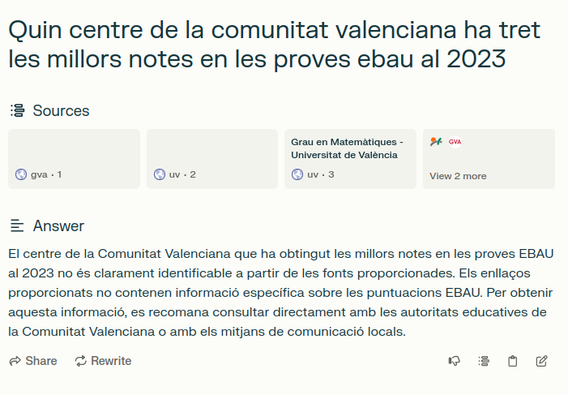{ width=10cm }

:::caution
Fixeu-vos que ell agafa unes referències que ell considera òptimes, però no són les ideals.
:::

{ width=10cm }

:::important
Fixeu-vos que les respostes donades no són una veritat absoluta, li hem donat un context. En aquest cas ens dona uns resultats basant-se en unes mitges numèriques que és el que ha considerat el diari com a millor o pitjor. Cal sempre tenir una capacitat de valoració per a saber el tipus de resposta que tenim.
:::

Si fem una qüestió més general, entendrem perquè aquesta ferramenta està orientada més a la cerca d'informació:

{ width=10cm }

Probablement altre chatbot com chatgpt ja ens hauria donat algun exemple sobre alguna recepta de cuina.

:::tip
Com vegeu cada IA té un propòsit específic. Per això és important en que no us quedeu només en una i que aneu investigant diferents versions de totes elles. També dependrà de les necessitats que tinguen en cada moment per a utilitzar-ne una o altra.
:::

## You

Podem trobar el cercador You a la pàgina: 

[https://you.com/](https://you.com/)

Al igual que Perplexity, you també és una IA centrada en la cerca d'informació, les respostes que ens dona són més naturals però no ens dona les referències d'on ha extret la informació. Fixem-nos quina resposta ens dona a la mateixa qüestió platejada a Perplexity:

{ width=10cm }

:::note
Si analitzem la resposta veurem que ens dona un resultat bastant diferent del que esperàvem, per això és important llegir la resposta ja que podem veure que ens diu clarament *han arribat a la selectivitat amb la millor nota mitjana de tota la Comunitat Valenciana al 2023*. I no està parlant concretament de la nota mitjana després sinó d'abans.
:::

# Creació d'imatges i vídeos

## Flexclip

Es tracta d'una ferramenta per a crear i editar videos, aquesta presenta una part on pots generar videos a partir de text. Cal ser molt específics amb el que es desitja ja que els resultats no són mai els que u està pensant. Podem accedir des [d'ací](https://www.flexclip.com).

Per a crear un video a partir de text hem d'anar a la ferramenta AI Video Generator:

{ width=10cm }

I escrivim un prompt en "Convertir text a vídeo":

{ width=10cm }

:::note
Es tracta d'una ferramenta de pagament com casi totes les que anem a veure, aquestes ens permeten crear una sèrie d'arxius multimèdia al dia. Així que cal tenir en compte aquestes limitacions. Flexclip és un editor de vídeo online molt potent.
:::

## Deepai

Podem accedir a deepai des [d'ací](https://deepai.org). Es tracta d'un generador d'imatges, videos, chat i música. Podem veure que com totes les IA cal donar un context més ample per a tindre un resultat més desitjat:

{ width=10cm }

:::caution
Nosaltres estem plantejant un prompt en valencià, els millors resultat sempre seran aquells que expressem en anglès. Generar imatges a partir de IA és un tant més complexe i requerix especificar clarament el que volem, sense donar peu a dubtes. Sempre podem modificar el prompt per anar buscant el resultat esperat. Dos coses que heu de tenir en compte quan creeu prompts per a imatge és que la primera frase és més important que l'última. Fixeu-vos com jo vull que apareguen els dos alumnes i canvie el prompt per a insistir-li.
Recordeu que les ordes que reb la intel·ligència artificial han de ser clares i directes. Oblidem-nos de l'educació, no és necessària!
:::

{ width=10cm }

Aquesta ferramenta permet crear tantes imatges com vullguen i és bastant útil si t'adaptes als seus gustos[^1]. Per a la creació de vídeos és bastant limitada, però permet creat uns pocs vídeos al mes (va variant cada vegadaa).

[^1]: quan parlem de gustos parlem de la manera que està entrenada la IA.


## Canva

Canva és una ferramenta que molts utilitzem per a generar les nostres creacions. A l'apartat de Apps podem trobar moltes ferramentes que fan ús de la IA per a generar imatges. Per a accedir a totes estes ferramentes anem a Apps al menú dret de Canva quan estem creant una imatge.

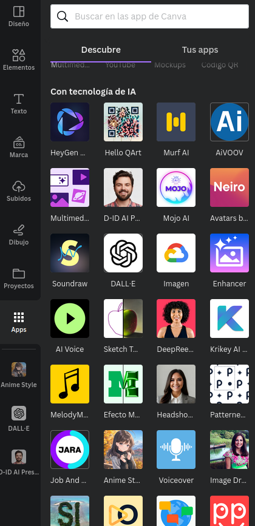{ width=10cm }

:::warning
Com quasi totes les ferramentes de IA per a generar imatges, aquestes tenen usos limitats, algunes  de les ferramentes de Canva et permeten crear 25 imatges al mes per exemple.
::: 

### Anime Style

Amb aquesta App de Canva pots crear imatges anime. us presentem un exemple.

\awesomebox[violet]{2pt}{\faRobot}{violet}{\textbf{Genera una professora amb un llibre en la mà.
Genera un professor enfadat amb un regle numerat en la mà}}

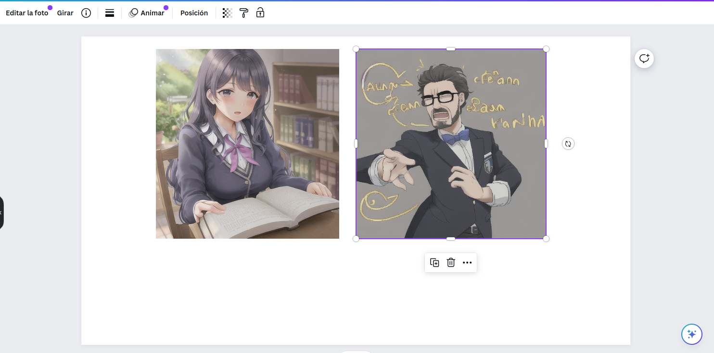{ width=10cm }

### DALL-E

La tecnologia DALL-E ens permet crear imatges a partir de text. A Canva hi ha una aplicació amb eixe nom limitada a la creació de 25 imatges al mes.

\awesomebox[violet]{2pt}{\faRobot}{violet}{\textbf{Professor ensenyant a dos alumnes en la platja per la nit les constel·lacions}}

{ width=10cm }

### D-ID AI Presenter

Podem generar àudio per a les presentacions però podem afegir una persona que parle mentre es fa la presentació. S'ha de connectar a plataforma externa i només permet la creació de 5 minuts.

{ width=10cm }

Hi han moltíssimes Apps més dins de Canva que utilitzen la IA per a facilitar-nos la tasca.


## Leonardo

Podem accedir a Leonardo des de la següent adreça: [https://app.leonardo.ai/](https://app.leonardo.ai/). Es tracta d'una altra aplicació per a crear imatges que presenta unes funcionalitats bastant interessants com per exemple Image generation, que és la generació d'imatges a partir de text i Realtime Canva.

{ width=10cm }

La funcionalitat de generació d'imatges és bastant interessant, pero la de realtime Canva va a generar-nos una imatge a partir d'un dibuix que creem, podem escanejar-lo i pujar-lo o simplement dibuixar-lo per a que ens faja una interpretació. Es tracta d'un model que generarà representacions artístiques a partir d'un concepte més senzill. Anirà generant-nos la imatge a partir del dibuix que anem fent:

{ width=10cm }

Fixeu-se que ens permet interactuar tant en les indicacions que li donem com a text com el que anem dibuixant, d'aquesta manera podem obtindre una imatge més ajustada al que busquem.

:::note
Està bastant optimitzada per a traure retrats, així que no us estranye si sempre crea imatges de persones de primer plànol. Et facilita 150 crèdits al dia per a la creació d'imatges.
:::

Una ferramenta semblant a esta la tenim amb [https://www.freepik.com/pikaso#](https://www.freepik.com/pikaso#). Et facilita 20 crèdits al dia per a la creació d'imatges (5 imatges). Té l'opci´ño de Sketch molt sembalnt al Realtime Canva de Leonardo. I té l'opció de Reimagine que pot crear una imartge a partir d'una altra que li facilitem.

## Bing Copilot

Hem estat parlant fins ara de Bing Copilot con a model de llenguatge però aquest també porta incorporada la tecnologia DALL-E i podem generar imatges des del mateix Chat de Bing copilot. Aquest et porta a la pàgina [https://www.bing.com/images/create?](https://www.bing.com/images/create?) per a que et dones d'alta i ja pots crear imatges. És recomanable tindre un compte de Outlook[^2] per a donar-se d'alta.

[^2]: No és recomanable usar el compte corporatiu. Com us hem comentat, creeu-vos un compte que no aneu a utiltizar més.

\awesomebox[violet]{2pt}{\faRobot}{violet}{\textbf{Genera una imatge anime d'una persona enginyera que està davant d'un rack de xarxa i està llevant un cable d'un switch}}


## Quina escollisc

OpenAI (ChatGPT) i Gemini també tenen la tecnologia implementada als seus chats, encara que OpenAI està més limitada, però la tendència és que cada vegada més i més plataformes implementen aquest sistemes de generació d'imatges, els resultats d'alguns d'ells poden ser millor que d'altres, sempre dependrà de la teua manera de generar el prompt.

:::caution
La IA no ha vingut per a crear-nos-ho tot sinó que nosaltres hem de saber que preguntem i com podem orientar-la per a traure els resultats esperats.
:::
 
 # Aplicacions per a donar a conèixer la IA a l'escola

Hi han moltíssimes ferramentes que ens permeten veure les possibilitats de la intel·ligència articial i apropar-la als nostres alumnes. Tal vegada ens quedem amb les ferramentes GPT, però hi han moltes altres possibilitats.

## Animated Drawings

Aquesta plataforma està orientada més a infantil i primària, i ens permet animar dibuixos senzills que realitzem amb els nostres alumnes. L'enllaç per a poder accedir és [https://sketch.metademolab.com/](https://sketch.metademolab.com/)

Nosaltres hem creat la següent imatge que pujem al model per a poder comprovar els resultats:

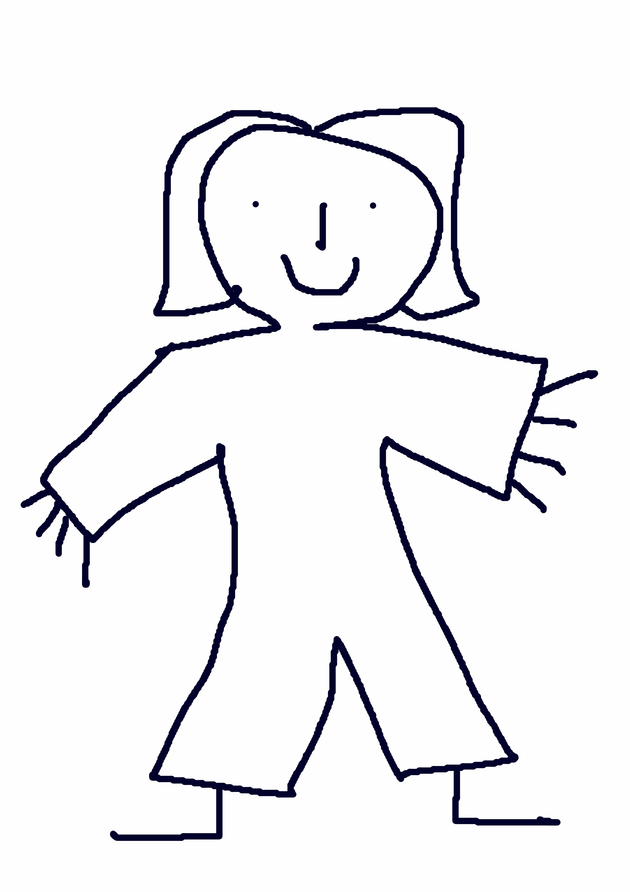{ width=5cm }

Ens permet així mateix [compartir](https://sketch.metademolab.com/share/f007a72f87b24dbd9be917d63215cf79/walk_sway) les nostres creacions.

{ width=10cm }

## Teachablemachine

Aquesta ferramenta, com ja hem comentat al mòdul 1, ens permet entrenar a xicoteta escala el nostre model d'intel·ligència artifial per a un propòsit, per exemple el de reconèixer objectes, sons o postures. Només ens cal una webcam per a fer-ho o unes imatges ja creades. Podem accedir a la plataforma des [d'ací](https://teachablemachine.withgoogle.com/).

{ width=10cm }

I creem el nostre primer projecte

{ width=10cm }

Nosaltres hem preparat un model per a distingir entre un bolígrag i unes tisores, hem anant pujant imatges de cadascun.

{ width=10cm }

Aquest model el podem exportar i el podem compartir. Òbviament el model que he creat no és massa interessant, però podem entrenar millors models amb moltes fotografies, d'objectes de la classe i crear el teu propi reconeixedor d'objectes. Podeu descarregar el model des d'ací: [https://teachablemachine.withgoogle.com/models/9OqM8E4An/](https://teachablemachine.withgoogle.com/models/9OqM8E4An/)

# Intel·ligència artificial vs Intel·ligència artificial

A tots ens ha sorgit el dubte quan realitzem un treball si realment l'ha creat un alumne o ha fet ús, ja no dels seus pares, sinó d'una eina GPT. Existeixen eines, encara que no siguen fiables al 100%, per comprovar si un text ha sigut creat amb alguna eina d'intel·ligència artificial.

## GPTzero 

Es tracta d'una ferramenta bastant interessant que ens permetrà saber si un text està generat per intel·ligència artificial. Tenim l'enllaç aquí [https://gptzero.me/](https://gptzero.me/). Si extraguem un text de qualsevol periòdic conegut i el passem per ací podem veure el resultat:


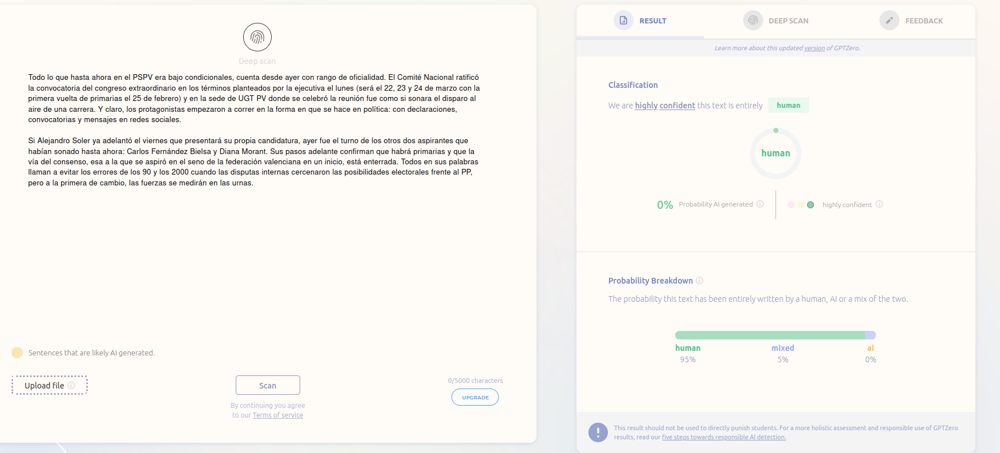

De tota manera no sempre et trau la realitat i, òbviament, existeix [https://www.humanizeaitext.org/](https://www.humanizeaitext.org/) o Quillbot, que servix per a humanitzar més el text generat per una IA per a que resulte menys "artificial"

## Quillbot

"Feta la llei feta la trampa", també existeix la contrapartida de GPTZero. [Quillbot](https://quillbot.com/) és una altra eina que ens permet modificar el text perquè parega menys d'una IA o simplement un text que vulguem expressar d'una altra manera. També disposa de moltes altres ferramentes interessants de modificació de text, encara la versió gratuïta està bastant limitada.


Tenim altres ferramentes per a humanitzar text que faran més difícil detectar si el text ha sigut creat per una IA o no, recordeu que sempre cal revisar el material general ja que poden aparèixer *alucinacions* o inclús canviar el sentit del text, com hem pogut veure. Alguns exemples són

* **Undetectable AI** [https://undetectable.ai/](https://undetectable.ai/). De pagament.
* **Trinka** [https://www.trinka.ai/es/](https://www.trinka.ai/es/)

# Creació d'àudio i vídeo

Estic segur que molts de vosaltres heu escoltat ja les ferramentes [sora](https://openai.com/index/sora/)(cal una subscripció a OpenAI). Aquestes ens permeten crear àudio a partir de text. Però hi han moltes altres ferramentes que ens permeten crear àudio i vídeo a partir de text. Les anomenades encara no estan disponibles en Europa i no estan lliures de problemes.

## Studio

Tot i que també funciona amb crèdits i permet un límit de creacions al mes, es tracta d'una ferramenta molt potent. Ens permet crear presentacions bastant naturals amb un avatar o una imatge nostra dient el que escrivim.

{ width=10cm }

Podem accedir a la ferramenta des d'aquí: [https://studio.d-id.com/editor](https://studio.d-id.com/editor)

:::warning
No penseu que podeu pujar la fotografia d'un famós perquè diga el que vosaltres vulgueu, la plataforma ho detecta i no us ho permet. Si voleu fer això com hem vist amb alguns personatges famosos parlant anglès quan no saben, heu de crear el model vosaltres mateixos i és una tasca bastant més complexa.
:::

[Synthesia](https://www.synthesia.io/), és altra ferramenta que ens permetrà igualment crear presentacions a partir d'un text, el funcionament és molt semblant a Studio. Limitat a 3 minuts de vídeo al mes.

[HeyGen](https://www.heygen.com/) igualment ens permet crear presentacions a partir de text.

## Rask

Es tracta d'una ferramenta que ens permet traduïr un vídeo, nosaltres hem agafat un vídeo d'[Eugenio](https://www.youtube.com/shorts/6xQ3aY9SVhA) per a sentir-lo parlant anglès. Pots accedir des d'ací: [https://rask.ai/](https://rask.ai/)

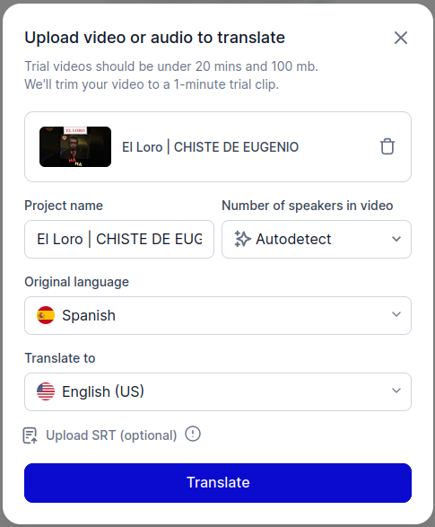{ width=10cm }

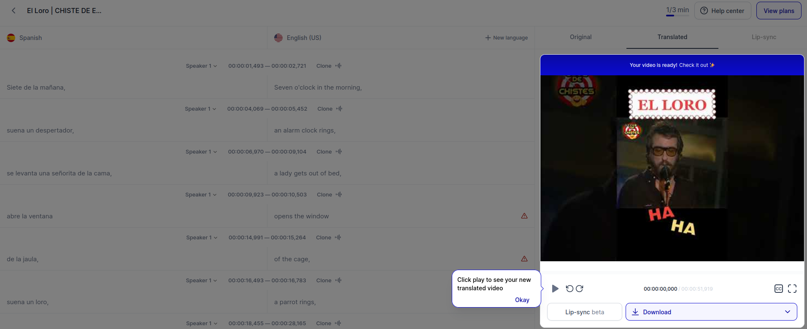{ width=10cm }

La veritat és que el resultat és bastant sorprenent.

## Opusclip

És una ferramenta que ens mostra les virtuts i les faltes de la IA, ens permet pujar un vídeo i fer-nos una explicació resumida del vídeo. En aquest cas pugem un vídeo d'un acudit però no es capaç de detectar la ironia o les gràcies (encara que siguen molt roïns). I s'ho pren com un vídeo seriós. A més li posa subtítols i ho fa d'una manera bastant acertada tractant-se de Chiquito de la Calzada. Podem veure el resultat:

{ width=10cm }

{ width=10cm }

Podem trobar la ferramenta [aquí](https://www.opus.pro/).

Una ferramenta similar és [https://www.you-tldr.com/](https://www.you-tldr.com/), però aquesta està especialitzada en vídeos de youtube.

## ElevenLabs

Aquesta ferramenta igualment ens permet convertir text a àudio o un àudio a altre àudio donant-li diferents entonacions o altra veu. 

{ width=10cm }

Podem accedir a la plataforma des [d'ací](https://elevenlabs.io/).

El mateix podem trobar a la plataforma [https://www.happyscribe.com/](https://www.happyscribe.com/).

## Suno

Suno és una aplicació que ens permet crear cançons a partir de text. Podem accedir a la plataforma des [d'ací](https://suno.com/).

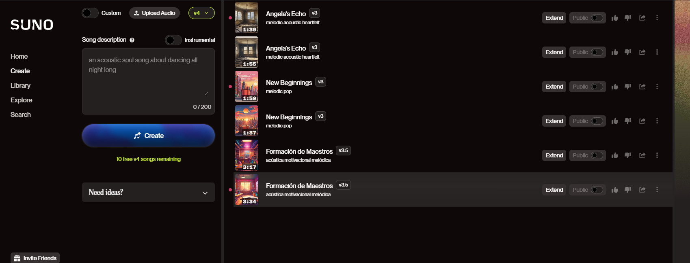{ width=13cm }

Podem crear una cançó a partir d'un text:

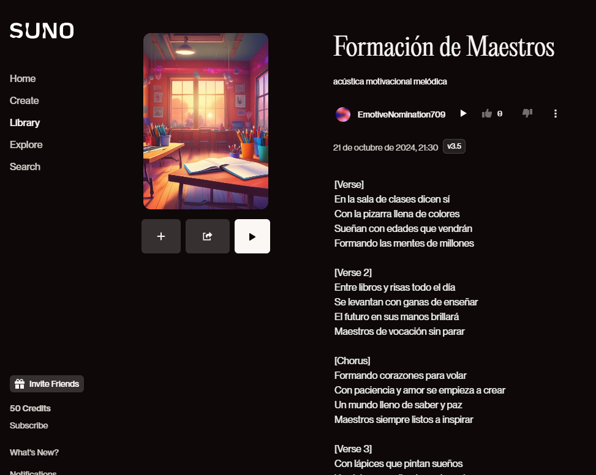{ width=13cm }

I podem compartir el resultat que pots escoltar [ací](https://suno.com/song/54550d23-9506-4a95-bca8-fc337c7ea88b).

## fal.ai

Aquesta paltaforma pensada per a desenvolupadors ens pot ser d'utilitat per a provar algun model que ens resulte interessant:

Ací teniu un example de text-to-video:

[https://fal.ai/models/fal-ai/ltx-video](https://fal.ai/models/fal-ai/ltx-video)

Una ferramenta semblant seria [replicate](https://replicate.com/). Podem trobar un exemple de text-to-video [ací](https://replicate.com/lightricks/ltx-video).

## Runway

Runway és una plataforma que ens permet crear imatges, vídeos, música, etc... a partir de text. És una plataforma de pagament però ens facilita 125 crèdits per a provar-la. Funciona bastant bé. Podem accedir a la plataforma des [d'ací](https://runwayml.com/).

## Altres aplicacions multimèdia d'interès

Existeixen altres aplicacions que paga la pena nombrar:

- GitMind en [https://gitmind.com/es/](https://gitmind.com/es/) és una aplicació gratuïta de mapes mentals i pluja de idees impulsada per IA.
- Decktopus en [https://www.decktopus.com/](https://www.decktopus.com/) és una plataforma de presentació impulsada per IA que ofereix una àmplia gamma de temes, fonts i colors.
- Gama en [https://gamma.app/](https://gamma.app/) és una ferramenta amn crèdits que ens permet crear presentacions a partir de text.
- SkyBox en [https://blockadelabs.com/](https://blockadelabs.com/) són una sèrie de ferramentes (skybox i blenbox) que ens permeten crear imatges
a aprtir de text. Té altra ferramenta que ens permet crear diverses imatges o carregar-ne una pròpia i a partir de 4 imatges crear una composició que es mescle bastant bé.

{ width=10cm }

- Microsoft Designer en [https://designer.microsoft.com/](https://designer.microsoft.com/) és una eina de disseny gràfic impulsada per IA que ajuda a crear dissenys professionals. És molt interessant ja que et peret crear imatges amb un tamnay optimitzat per presentacions qualsevol document d'Office, o per a publicacions d'Instagram, etc...

- [Simpleshow](https://videos.simpleshow.com) és una eina que ens permet crear videotutorials plantejant-li un prompt. Aquesta l'hem utilitzada al mòdul I per a crear el vídeo de presentació.

## Quina triar?

Hui en dia podem trobar l'ús de la IA pràcticament en qualsevol eina o dispositiu. Estem davant d'una tecnologia que ha tingut el seu boom en els últims dos anys i cada vegada hi haurà més i més oferta d'aquest tipus d'eines. Si l'ús que li donaràs és esporàdic, és recomanable utilitzar aquelles que són gratuïtes.

# Generació de materials didàctics

Les següents ferramentes ens permeten crear materials de manera ràpida i senzilla ja preparats per a publicar. 

:::warning
Cal tenir en compte que els materials que et genera estan basats en altres materials que té com a referència la IA. I poden ser o no adequats al que tu esperes, tot allò que cree és necessari revisar-ho.
:::

## Mindsmith

[Mindsmith](https://www.mindsmith.ai/) és una de les plataformes existents per a crear materials a mode de presentació:

{ width=10cm }

Li donem un prompt per a que ens genere uns materials generals. Cal tenir en compte tot allò que hem vist sobre prompts, quan més detallat siga el prompt millors resultats obtindrem. A més et genera un qüestionari sobre la unitat creada. us deixem una unitat d'exemple creada amb Mindsmith:

[https://app.mindsmith.ai/learn/clrxvtgi8009ijn083uor8946](https://app.mindsmith.ai/learn/clrxvtgi8009ijn083uor8946)

:::caution
La plataforma ens limita a la creació de 5 unitats i només ens deixa compartir dos a no ser que paguem la quota.
:::

## LearningStudioAI

Una ferramenta interessant és: [LearningStudioAI](https://learningstudioai.com/) per generar automàticament cursos. Ens permet crear cursos a partir de textos que li facilitem. Ens genera un curs amb diferents mòduls i ens permet descarregar-lo en format SCORM per a poder-lo pujar a la nostra plataforma de formació.

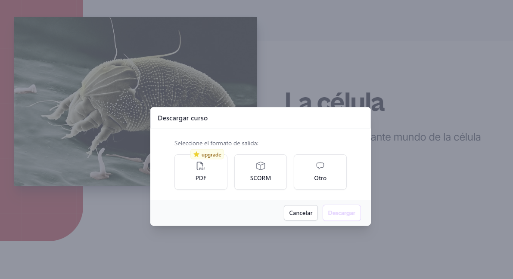

## Schemely

[Schemely](https://schemely.app/) és una plataforma de creació de cursos per a professors, amb AI generativa. És bastant completa i ens permet enllaçar la planificació generada amb altres ferramentes per a crear materials  addicionals.

:::note
Quan ens demana el títol del curs penseu que esteu realitzant el prompt al model, per tant podeu ser detallistes al respecte.
:::


És interessant veure com ja ens apareixen els enllaços perquè ens cree amb altres ferramentes aquesta part del curs.

:::note
Esta ferramenta ens permet crear dos cursos al mes de manera gratuïta. Es renova a cada mes.
:::

## TutorAI

[TutorAI](https://www.tutorai.me/) és una aplicació pensada per a l'autoaprenentatge. Li exposem un tema i ens donarà diferents mòduls per a poder aprendre.


## MagicSchoolAi

[MagicSchoolAi](https://www.magicschool.ai/) és un conjunt de ferramentes agrupades que ens permet crear materials per l'aula. Una opció interessant és la de crear un qüestionari a partir d'una temàtica. El qüestionaris d'aquest curs estan creats amb aquesta ferramenta.


:::note
Al igual que les altres, ens dona un periode gratuït de mostra. Però posteriorment, tot i que no es poden utilitzar totes les ferramentes, les que pots utilitzat són de gran utilitat. És probablement una de les ferramentes més útils.
:::

## Altres ferramentes

Existeixen multituds de ferramentes. Però totes elles semblants per a crear materials. us proposem que feu una ullada a altres ferramentes com:

### Quizgecko

[Quizgecko](https://quizgecko.com/) és una plataforma de creació de qüestionaris en línia que ens ajuda a crear qüestionaris interactius i atractius per als estudiants.

### Quillionz

[Quillionz](https://app.quillionz.com/) és una eina que utilitza intel·ligència artificial per generar automàticament preguntes de opció múltiple, de discussió obertes o «interpretatives» i de debats amb les respostes corresponents, a partir de documents adjuntats. La ferramenta és totalment gratuïta, tot i que té comptes Premium o de pagament, amb més funcions.

### GitMind

[GitMind](https://gitmind.com/es/) és una aplicació gratuïta de mapes mentals i pluja de idees. També funcioan per crèdits i ens permet crear esquemes d'una manera bastant eficient.


# Altres ferramentes interessants

## ChatPDF

Personalment [ChaPDF](https://www.chatpdf.com) és una de les aplicacions que més utilitze. En aquest cas es pot pujar un PDF i "parlar" amb ell, pots fer-li preguntes diverses. En aquest cas hem pujat la normativa de cursos. Les respostes que dona no són 100% correctes però et pot donar una idea i, el millor, és que t'enllaça la resposta a la part del document on es parla d'eixe tema:


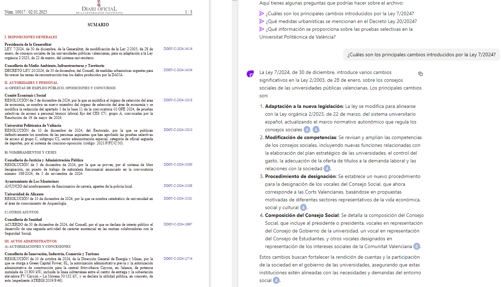

:::note
Alguns pdfs poden ser massa grans i no els accepta. Per tant cal pujar pdfs comprimits (utilitzant la ferramente de [https://www.ilovepdf.com/es/comprimir_pdf](https://www.ilovepdf.com/es/comprimir_pdf))
:::

## Geospy

[Geospy](https://geospy.web.app/) és una ferramenta que ens permet conèixer el lloc d'on és una imatge. És molt interessant perquè et fa un raonament de perquè creu que és eixe lloc o un altre. Molts pensareu que utilitza les metadates per saber-ho però donats els raonaments, et fan dubtar. Els resultats solen ser bastant certers, però a l'exemple podem veure que no sempre és fiable (es tracta d'una fotografia de la superficie de la lluna):


# ComfyUI

[ComfyUI](https://comfyui.org/) és una eina que ens permet crear una interfície d'usuari per a qualsevol aplicació o pàgina web. És una eina molt interessant per a crear una interfície d'usuari atractiva i fàcil d'utilitzar.

Esta ferramenta és fonamental per veure com funciona la creació d'imatges amd diferents models. No anem a entrar en detall sobre el funcionament ja que pràcticament caldria un curs complet per a explicar totes les seues possibilitats, i un ordinador molt potent.

La seua instal·lació no és habitual i té certa complexitat. Però una vegada configurada és una eina que paga la pena tenir-la, ja que ens permetrà crear imatges (i si tens un ordinador molt molt molt potent vídeos) de manera ilimitada.

Podeu descarregar la ferramenta des [d'ací](https://github.com/comfyanonymous/ComfyUI/releases/latest/download/ComfyUI_windows_portable_nvidia.7z). Una vegada descarregat descomprimiu el fitxer polsant el botó dret del ratolí.


:::warning
Assegura't de tindre bastant espai ja que la instal·lació ocupa bastant (uns 5gb).
:::

Per a descarregar un model d'exemple podeu anar a [https://civitai.com/models/4384/dreamshaper](https://civitai.com/models/4384/dreamshaper) i descarregar eixe model. Civitai és una pàgina que ens permet descarregar models de manera gratuïta, però no tots els models vos van a funcionar. També podeu utilitzar huggingface per a descarregar models. Per a descarregar un model de huggingface aneu a [https://huggingface.co/](https://huggingface.co/) i descarregueu el model que més vos interese. El model que vos propossem és el de DreamShaper, que é sun model lleufer per a crear imatges anime. Així i tot, proveu quan de temps tarda en crear una imatge al vostre ordinador, en el meu cas amb un ordinador estàndard tarda uns 13 minuts en crear una imatge. Amb una targeta gràfica NVIDIA(1650 GTX, que és bastant antiga) tarda uns 3 minuts.


:::caution
Ens centrarem només amb la creació d'imatges, ja que podeu estar molt de temps creant un vídeo amb un ordinador estàndard (amb referisc a un ordinador estàndar, un ordinador de fa 3-4 anys amb 8gb de RAM i un i5 o Ryzen5). 
:::

Una vegada hem descarregat el model l'hem de posar en la següent carpeta: **\\ComfyUI_windows_portable\\ComfyUI\\models\\checkpoints**. 

Finalment si entrem en la carpeta podem veure que hi ha dos executables, executem run_cpu.bat. si estem segurs que tenim una targeta gràfica NVIDIA podeu executar run_nvidia_gpu.bat. La primera vegada que el descarregueu taradarà un poc en carregar, però una vegada carregat ja podreu començar a crear imatges.

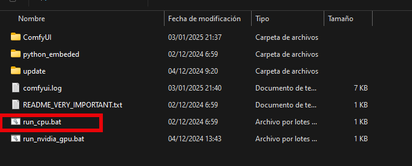

:::warning
Este procés està explicat per a un ordinador amb Windows. Per a usuaris Mac i Linux el procés és bastant més complexe i necessiteu tenir coneixements de git i un poc de l'entorn python (no programar amb python. Podeu trobar informació [ací.](https://comfyui-wiki.com/es/install/install-comfyui/install-comfyui-on-linux))
:::

La primera vegada que executeu l'alicació vos a apreixerà ja un diagrama de fluxe on tindreu dos recuadres per a afegit in prompt i un pront negatiu.

* El prompt de la imatge ha de ser detallat, quan més detallat millor.
* El prompt negatiu és el que no volem que aparega en la imatge.

Ònviment el model pot interpretar el prompt de manera diferent a la que vosaltres penseu, i caldrà anar modificant-lo fins aconseguir el resultat desitjat.


Aquest programa permet anar més enllà i es poden fer moltes més coses. Segur que moltes vegades vos preguntareu, perquè no em surt la imatge que vull si estic detallant molt bé el prompt. Fixeu-vos que en aquest cas també podeu jugar amb el paràmetres del model. I un concepte interessant que podem utilitzar és el de "LoRA" (Low-Rank Adaptation) que són elements que podem afegir al model que estan entrenats per a tasques específiques, en aquest cas hem utilitzat un **LORA** que adapta el model per a la creació de logos, podem veure la diferència:


La majoria dels models de generació d'imatges que podem trobar en diferents pàgines d'internet no ens permeten crear adaptacions dels models, aquest programa ens permet afinar més en la creació de les imatges, però té la seua complexitat. A més permet la creació de vídeos, però com ja hem comentat, cal tindre un ordinador molt potent per a poder crear-los.

# I si no trobe el que busque.

Aquí hem tractat d'exposar-vos diverses ferramentes que utilitzen la IA, hi han moltíssimes i cada vegada n'existeixen més i més. Existeix una pàgina que va recopilant totes i cadascuna d'elles. Si no trobes el que busques o busques alguna alternativa es pot visitar la següent pàgina. Sempre hi haurà alguna que s'adapte al que estàs buscant.

https://theresanaiforthat.com/

Cal que tenir en compte que el gran boom de la intel·ligència artificial va ser al 2022, cada vegada aniran existint millors ferramentes i més accesibles, més econòmiques o inclús més gratuïtes. Aquestes propostes que us platengem és per que vegeu que és el que ens espera en els propers anys i aneu acostumant-vos a utilitzar aquest tipus de ferramentes i les aneu implementant dins la vostra Aula. Només cal que penseu com estavem amb el mòbils fa 10 anys i com de cares eren les cridades...

Vos deixem per a finalitzar aquesta unitat una frase extreta d'un article que cal plantejar-se:

> “¿Recuerdan el popular portal 'El rincón del vago'? Pues ni en sus mejores sueños pudieron imaginar los plagiadores la llegada de un instrumento tan eficaz. Fue cuestión de tiempo que universidades americanas y australianas prohibieran el uso de esta herramienta para lograr que sus estudiantes copiasen.
Dado que la historia nos enseña que la evolución tecnológica es casi imposible de contener, hubo visiones que preferían que se afrontara el debate de cómo incorporar el uso de ChatGPT a las aulas y al aprendizaje.
La inteligencia artificial revolucionará, de alguna manera u otra, el papel del profesor. Ahora el conocimiento ya no pertenece exclusivamente al maestro, sino que está por todas partes. Pero evidentemente, el docente es y seguirá siendo la persona adecuada que ayude a los alumnos a interpretarlo."[^4]

[^4]: https://www.eldebate.com/educacion/20230415/chatgpt-educacion-enemigo-aliado-profesores_106508.html


