---
# Información general del documento
title: 3. Creación multimedia con IA
lang: es
page-background: img/bg.png

# Portada
titlepage: true
titlepage-rule-height: 2
titlepage-rule-color: eeeee4
titlepage-text-color: eeeee4
titlepage-background: img/U3c.png

# Tabla de contenidos
toc: true
toc-own-page: true
toc-title: Contenidos

# Cabeceras y pies
header-left: 3. Creación multimedia con IA
header-right: Curso 2024-2025
footer-left: CEFIRE FP
footer-right: \thepage/\pageref{LastPage}

# Imágenes
float-placement-figuro: H
caption-justification: centering

# Listados de código
listings-no-page-break: true
listings-disable-line-numbers: false

header-includes:
- |
  ```{=latex}
  \usepackage{lastpage}
  \usepackage{awesomebox}
  \usepackage{caption}
  \usepackage{array}
  \usepackage{tabularx}
  \usepackage{ragged2e}
  \usepackage{multirow}
  \usepackage{xcolor}

  ```
pandoc-latex-environment:
  noteblock: [note]
  tipblock: [tip]
  warningblock: [warning]
  cautionblock: [caution]
  importantblock: [important]
...

<!-- \awesomebox[violet]{2pt}{\faRocket}{violet}{Lorem ipsum…} -->

<!-- \awesomebox[violet]{2pt}{\faRobot}{violet}{Lorem ipsum…} -->

<!-- IMATGE { width=10cm } -->

<!-- \textbf{greatest} -->

<!-- \awesomebox[violet]{2pt}{\faRobot}{violet}{\textbf{greatest}\hfill \break} -->

\vspace{\fill}

{ height=50px }

Este documento está sujeto a una licencia creative commons que permite su difusión y uso comercial reconociendo siempre la autoría de su creador. Este documento se encuentra para ser modificado en el siguiente repositorio de github:
<!-- CANVIAR L'ENLLAÇ -->
[https://github.com/arvicenteboix/AICurs25](https://github.com/arvicenteboix/AICurs25)
\newpage


# Introducción

Hasta ahora hemos visto algunas herramientas GPT, pero en la red podemos encontrar un montón de aplicaciones que hacen uso de la inteligencia artificial para crear casi cualquier producto multimedia. En este módulo os plantearemos algunas herramientas que os pueden ser de utilidad en vuestro día a día. Pero como bien sabréis, son solo unos cuantos ejemplos. Estoy seguro de que vosotros conoceréis muchas más y que serán tan útiles como las planteadas aquí.

En este módulo os hablaremos de diferentes herramientas que nos resultan interesantes, obviamente hay muchísimas más. Pero os introduciremos a la herramienta ComfyUI que es importante conocer para afinar los resultados. Esta herramienta la podéis utilizar en una página web (de pago) o instalarla en vuestro ordenador, pero necesitaréis un ordenador con una tarjeta gráfica dedicada.

Debemos entender que cada herramienta utiliza un modelo distinto, al igual que en las herramientas GPT (text-to-text) también existen diferentes modelos y cada uno está adaptado a un propósito.

:::warning
Es recomendable que os creéis un correo aleatorio para poder inscribiros y probar así todas las herramientas sin necesidad de tener que dar vuestro correo personal. Si alguna os interesa mucho, sí podríais utilizar vuestro correo
:::

## Perplexity

Perplexity tiene un entorno similar a los bots conversacionales, pero está centrado en la búsqueda de información y siempre partiendo de unas fuentes, que bien buscará él o podrás proporcionar tú. Podemos acceder desde aquí:

[http://www.perplexity.ai](http://www.perplexity.ai)

:::info
Como en todas las plataformas, será necesario acceder con una cuenta de Google o registrarse en la página.
:::

Aquí tenéis un ejemplo que ilustra un poco lo que estamos comentando. Si le preguntamos a Perplexity:

\awesomebox[violet]{2pt}{\faRobot}{violet}{\textbf{¿Qué centro de la Comunidad Valenciana ha sacado las mejores notas en las pruebas EBAU en 2023?}\hfill \break
Podemos ver que las respuestas que nos da difieren de si le damos un contexto o no} 

{ width=10cm }

:::caution
Fijaos que él toma unas referencias que considera óptimas, pero no son las ideales.
:::

{ width=10cm }

:::important
Fijaos que las respuestas dadas no son una verdad absoluta, le hemos dado un contexto. En este caso nos da unos resultados basándose en unas medias numéricas que es lo que ha considerado el diario como mejor o peor. Siempre es necesario tener la capacidad de valorar para saber el tipo de respuesta que tenemos.
:::

Si hacemos una pregunta más general, entenderemos por qué esta herramienta está orientada más a la búsqueda de información:

{ width=10cm }

Probablemente otro chatbot como ChatGPT ya nos habría dado algún ejemplo sobre alguna receta de cocina.

:::tip
Como veis, cada IA tiene un propósito específico. Por eso es importante que no os quedéis solo en una y que vayáis investigando diferentes versiones de todas ellas. También dependerá de las necesidades que tengáis en cada momento para utilizar una u otra.
:::

## You

Podemos encontrar el buscador You en la página:

[https://you.com/](https://you.com/)

Al igual que Perplexity, You también es una IA centrada en la búsqueda de información. Las respuestas que nos da son más naturales, pero no nos da las referencias de dónde ha extraído la información. Fijémonos en qué respuesta nos da a la misma cuestión planteada a Perplexity:

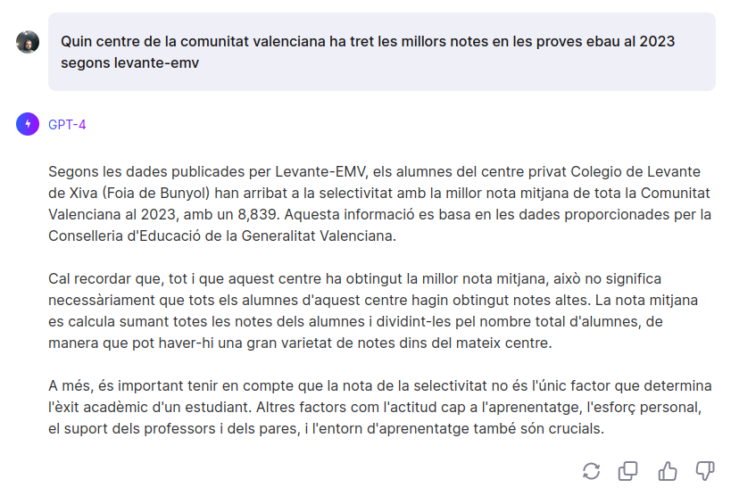{ width=10cm }

:::note
Si analizamos la respuesta, veremos que nos da un resultado bastante diferente del que esperábamos, por eso es importante leer la respuesta ya que podemos ver que nos dice claramente *han llegado a la selectividad con la mejor nota media de toda la Comunidad Valenciana en 2023*. Y no está hablando concretamente de la nota media después, sino de antes.
:::


# Creación de imágenes y vídeos

## Flexclip

Se trata de una herramienta para crear y editar videos. Esta presenta una parte donde puedes generar videos a partir de texto. Hay que ser muy específicos con lo que se desea ya que los resultados no siempre son lo que uno está pensando. Podemos acceder desde [aquí](https://www.flexclip.com).

Para crear un video a partir de texto, debemos ir a la herramienta AI Video Generator:

{ width=10cm }

Y escribir un prompt en "Convertir texto a video":

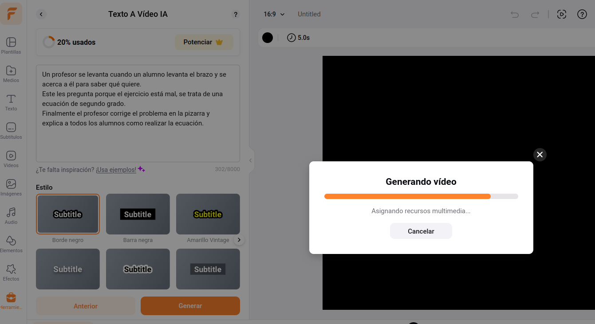{ width=10cm }

:::note
Se trata de una herramienta de pago como casi todas las que vamos a ver. Estas nos permiten crear una serie de archivos multimedia al día. Así que hay que tener en cuenta estas limitaciones. Flexclip es un editor de video online muy potente.
:::

## Deepai

Podemos acceder a Deepai desde [aquí](https://deepai.org). Se trata de un generador de imágenes, videos, chat y música. Podemos ver que, como todas las IA, es necesario dar un contexto más amplio para tener un resultado más deseado:

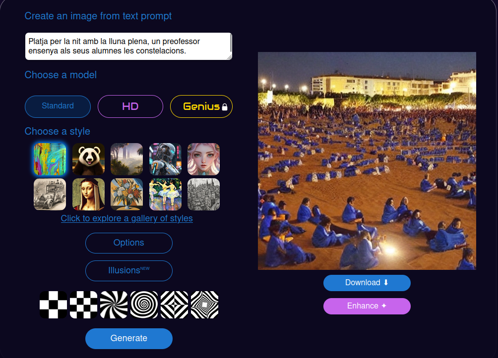{ width=10cm }

:::caution
Nosotros estamos planteando un prompt en valenciano; los mejores resultados siempre serán aquellos que expresemos en inglés. Generar imágenes a partir de IA es un tanto más complejo y requiere especificar claramente lo que queremos, sin dar lugar a dudas. Siempre podemos modificar el prompt para buscar el resultado esperado. Dos cosas que deben tener en cuenta cuando creen prompts para imágenes es que la primera frase es más importante que la última. Fíjense cómo quiero que aparezcan los dos alumnos y cambio el prompt para insistirle.
Recuerden que las órdenes que recibe la inteligencia artificial deben ser claras y directas. ¡Olvidémonos de la educación, no es necesaria!
:::

{ width=10cm }

Esta herramienta permite crear tantas imágenes como se deseen y es bastante útil si te adaptas a sus gustos[^1]. Para la creación de videos es bastante limitada, pero permite crear unos pocos videos al mes (va variando cada vez).

[^1]: Cuando hablamos de gustos, nos referimos a la manera en que está entrenada la IA.

## Canva

Canva es una herramienta que muchos utilizamos para generar nuestras creaciones. En el apartado de Apps podemos encontrar muchas herramientas que hacen uso de la IA para generar imágenes. Para acceder a todas estas herramientas, vamos a Apps en el menú derecho de Canva cuando estamos creando una imagen.

{ width=10cm }

:::warning
Como casi todas las herramientas de IA para generar imágenes, estas tienen usos limitados; algunas de las herramientas de Canva te permiten crear 25 imágenes al mes, por ejemplo.
:::

### Anime Style

Con esta app de Canva, puedes crear imágenes anime. Les presentamos un ejemplo.

\awesomebox[violet]{2pt}{\faRobot}{violet}{\textbf{Genera una profesora con un libro en la mano.
Genera un profesor enfadado con una regla numerada en la mano}}

{ width=10cm }


### DALL-E

La tecnología DALL-E nos permite crear imágenes a partir de texto. En Canva hay una aplicación con ese nombre, limitada a la creación de 25 imágenes al mes.

\awesomebox[violet]{2pt}{\faRobot}{violet}{\textbf{Profesor enseñando a dos alumnos en la playa por la noche las constelaciones}}

{ width=10cm }

### D-ID AI Presenter

Podemos generar audio para las presentaciones, pero podemos añadir una persona que hable mientras se realiza la presentación. Hay que conectarse a una plataforma externa y solo permite la creación de 5 minutos.

{ width=10cm }

Hay muchísimas más apps dentro de Canva que utilizan la IA para facilitarnos la tarea.


## Leonardo

Podemos acceder a Leonardo desde la siguiente dirección: [https://app.leonardo.ai/](https://app.leonardo.ai/). Se trata de otra aplicación para crear imágenes que presenta unas funcionalidades bastante interesantes como, por ejemplo, Image Generation, que es la generación de imágenes a partir de texto y Realtime Canva.

{ width=10cm }

La funcionalidad de generación de imágenes es bastante interesante, pero la de Realtime Canva genera una imagen a partir de un dibujo que creamos. Podemos escanearlo y subirlo o simplemente dibujarlo para que haga una interpretación. Se trata de un modelo que generará representaciones artísticas a partir de un concepto más sencillo. Irá generando la imagen a partir del dibujo que vayamos haciendo:

{ width=10cm }

Fíjate que nos permite interactuar tanto en las indicaciones que le damos como texto como en lo que vamos dibujando, de esta manera podemos obtener una imagen más ajustada a lo que buscamos.

:::note
Está bastante optimizada para retratos, así que no te extrañe si siempre crea imágenes de personas en primer plano. Te facilita 150 créditos al día para la creación de imágenes.
:::

Una herramienta similar a esta es [https://www.freepik.com/pikaso#](https://www.freepik.com/pikaso#). Te facilita 20 créditos al día para la creación de imágenes (5 imágenes). Tiene la opción de Sketch, muy similar al Realtime Canva de Leonardo, y tiene la opción de Reimagine, que puede crear una imagen a partir de otra que le proporcionemos.

## Bing Copilot

Hemos estado hablando hasta ahora de Bing Copilot como modelo de lenguaje, pero este también incorpora la tecnología DALL-E y podemos generar imágenes desde el mismo chat de Bing Copilot. Este te lleva a la página [https://www.bing.com/images/create?](https://www.bing.com/images/create?) para que te des de alta y ya puedes crear imágenes. Es recomendable tener una cuenta de Outlook[^2] para registrarse.

[^2]: No es recomendable usar la cuenta corporativa. Como te hemos comentado, créate una cuenta que no vayas a utilizar más.

\awesomebox[violet]{2pt}{\faRobot}{violet}{\textbf{Genera una imagen anime de una persona ingeniera que está delante de un rack de red y está quitando un cable de un switch}}


## Cuál elegir

OpenAI (ChatGPT) y Gemini también tienen la tecnología implementada en sus chats, aunque OpenAI está más limitada. La tendencia es que cada vez más y más plataformas implementen estos sistemas de generación de imágenes. Los resultados de algunos de ellos pueden ser mejores que otros, siempre dependerá de tu manera de generar el prompt.

:::caution
La IA no ha venido para crearnos todo, sino que nosotros debemos saber qué preguntamos y cómo podemos orientarla para obtener los resultados esperados.
:::

# Aplicaciones para dar a conocer la IA en la escuela

Existen muchísimas herramientas que nos permiten ver las posibilidades de la inteligencia artificial y acercarla a nuestros alumnos. Tal vez nos quedemos con las herramientas GPT, pero hay muchas otras posibilidades.

## Animated Drawings

Esta plataforma está orientada más a infantil y primaria, y nos permite animar dibujos sencillos que realizamos con nuestros alumnos. El enlace para poder acceder es [https://sketch.metademolab.com/](https://sketch.metademolab.com/)

Nosotros hemos creado la siguiente imagen que subimos al modelo para poder comprobar los resultados:

{ width=5cm }

Nos permite asimismo [compartir](https://sketch.metademolab.com/share/f007a72f87b24dbd9be917d63215cf79/walk_sway) nuestras creaciones.

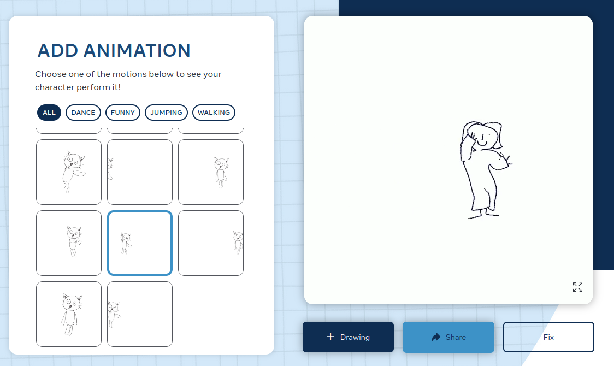{ width=10cm }

## Teachablemachine

Esta herramienta, como ya hemos comentado en el módulo 1, nos permite entrenar a pequeña escala nuestro modelo de inteligencia artificial para un propósito, por ejemplo, el de reconocer objetos, sonidos o posturas. Solo necesitamos una webcam para hacerlo o unas imágenes ya creadas. Podemos acceder a la plataforma desde [aquí](https://teachablemachine.withgoogle.com/).

{ width=10cm }

Y creamos nuestro primer proyecto.

{ width=10cm }

Nosotros hemos preparado un modelo para distinguir entre un bolígrafo y unas tijeras, subiendo imágenes de cada uno.

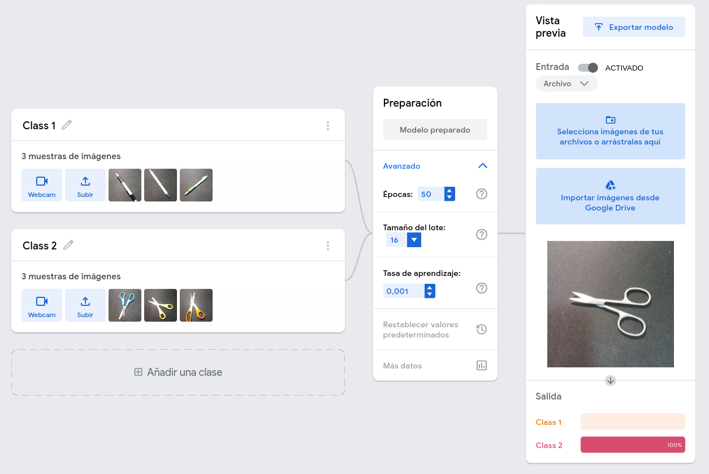{ width=10cm }

Este modelo lo podemos exportar y compartir. Obviamente, el modelo que he creado no es muy interesante, pero podemos entrenar mejores modelos con muchas fotografías de objetos de la clase y crear tu propio reconocedor de objetos. Puedes descargar el modelo desde aquí: [https://teachablemachine.withgoogle.com/models/9OqM8E4An/](https://teachablemachine.withgoogle.com/models/9OqM8E4An/)

# Inteligencia artificial vs Inteligencia artificial

A todos nos ha surgido la duda al realizar un trabajo si realmente lo ha creado un alumno o ha hecho uso, ya no de sus padres, sino de una herramienta GPT. Existen herramientas, aunque no sean fiables al 100%, para comprobar si un texto ha sido creado con alguna herramienta de inteligencia artificial.

## GPTzero

Se trata de una herramienta bastante interesante que nos permitirá saber si un texto está generado por inteligencia artificial. Tenemos el enlace aquí [https://gptzero.me/](https://gptzero.me/). Si extraemos un texto de cualquier periódico conocido y lo pasamos por aquí, podemos ver el resultado:


De todas maneras, no siempre refleja la realidad. Existen también [https://www.humanizeaitext.org/](https://www.humanizeaitext.org/) o Quillbot, que sirven para humanizar más el texto generado por una IA para que resulte menos "artificial".


## Quillbot

"Hecha la ley, hecha la trampa", también existe la contraparte de GPTZero. [Quillbot](https://quillbot.com/) es otra herramienta que nos permite modificar el texto para que parezca menos de una IA o simplemente un texto que queramos expresar de otra manera. También dispone de muchas otras herramientas interesantes de modificación de texto, aunque la versión gratuita está bastante limitada.

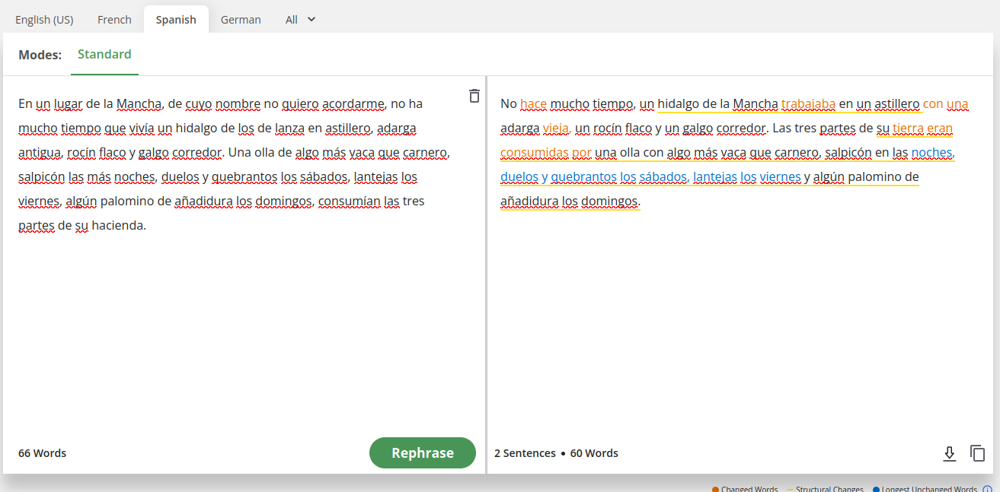

Tenemos otras herramientas para humanizar texto que harán más difícil detectar si el texto ha sido creado por una IA o no. Recuerda que siempre es necesario revisar el material generado ya que pueden aparecer *alucinaciones* o incluso cambiar el sentido del texto, como hemos podido ver. Algunos ejemplos son:

* **Undetectable AI** [https://undetectable.ai/](https://undetectable.ai/). De pago.
* **Trinka** [https://www.trinka.ai/es/](https://www.trinka.ai/es/)

# Creación de audio y video

Estoy seguro de que muchos de vosotros ya habéis escuchado las herramientas [sora](https://openai.com/index/sora/) (requiere una suscripción a OpenAI). Estas nos permiten crear audio a partir de texto. Pero hay muchas otras herramientas que nos permiten crear audio y video a partir de texto. Las mencionadas aún no están disponibles en Europa y no están libres de problemas.

## Studio

Aunque también funciona con créditos y permite un límite de creaciones al mes, se trata de una herramienta muy potente. Nos permite crear presentaciones bastante naturales con un avatar o una imagen nuestra diciendo lo que escribimos.

{ width=10cm }

Podemos acceder a la herramienta desde aquí: [https://studio.d-id.com/editor](https://studio.d-id.com/editor)

:::warning
No pienses que puedes subir la fotografía de un famoso para que diga lo que tú quieras, la plataforma lo detecta y no te lo permite. Si deseas hacer esto, como hemos visto con algunos personajes famosos hablando inglés cuando no lo saben, debes crear el modelo tú mismo, lo cual es una tarea bastante más compleja.
:::

[Synthesia](https://www.synthesia.io/) es otra herramienta que nos permitirá igualmente crear presentaciones a partir de un texto. El funcionamiento es muy similar a Studio y está limitado a 3 minutos de video al mes.

[HeyGen](https://www.heygen.com/) igualmente nos permite crear presentaciones a partir de texto.

## Rask

Se trata de una herramienta que nos permite traducir un video. Nosotros hemos tomado un video de [Eugenio](https://www.youtube.com/shorts/6xQ3aY9SVhA) para escucharlo hablando inglés. Puedes acceder desde aquí: [https://rask.ai/](https://rask.ai/)

{ width=10cm }

{ width=10cm }

La verdad es que el resultado es bastante sorprendente.


## Opusclip

Es una herramienta que nos muestra las virtudes y las faltas de la IA, nos permite subir un video y hacer una explicación resumida del video. En este caso subimos un video de un chiste pero no es capaz de detectar la ironía o las gracias (aunque sean muy malas). Y lo toma como un video serio. Además le pone subtítulos y lo hace de una manera bastante acertada tratándose de Chiquito de la Calzada. Podemos ver el resultado:

{ width=10cm }

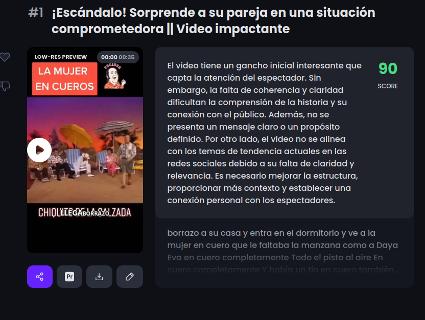{ width=10cm }

Podemos encontrar la herramienta [aquí](https://www.opus.pro/).

Una herramienta similar es [https://www.you-tldr.com/](https://www.you-tldr.com/), pero esta está especializada en videos de YouTube.

## ElevenLabs

Esta herramienta igualmente nos permite convertir texto a audio o un audio a otro audio dándole diferentes entonaciones o otra voz.

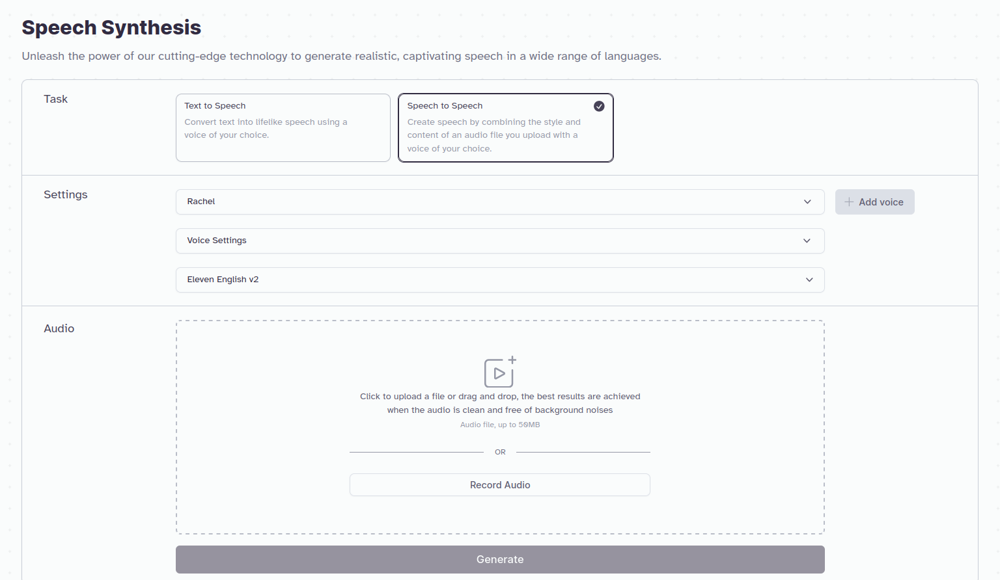{ width=10cm }

Podemos acceder a la plataforma desde [aquí](https://elevenlabs.io/).

Lo mismo podemos encontrar en la plataforma [https://www.happyscribe.com/](https://www.happyscribe.com/).

## Suno

Suno es una aplicación que nos permite crear canciones a partir de texto. Podemos acceder a la plataforma desde [aquí](https://suno.com/).

{ width=13cm }

Podemos crear una canción a partir de un texto:

{ width=13cm }

Y podemos compartir el resultado que puedes escuchar [aquí](https://suno.com/song/54550d23-9506-4a95-bca8-fc337c7ea88b).

## fal.ai

Esta plataforma, pensada para desarrolladores, nos puede ser de utilidad para probar algún modelo que nos resulte interesante:

Aquí tienes un ejemplo de text-to-video:

[https://fal.ai/models/fal-ai/ltx-video](https://fal.ai/models/fal-ai/ltx-video)

Una herramienta similar sería [Replicate](https://replicate.com/). Podemos encontrar un ejemplo de text-to-video [aquí](https://replicate.com/lightricks/ltx-video).


## Runway

Runway es una plataforma que nos permite crear imágenes, videos, música, etc., a partir de texto. Es una plataforma de pago pero nos facilita 125 créditos para probarla. Funciona bastante bien. Podemos acceder a la plataforma desde [aquí](https://runwayml.com/).

## Otras aplicaciones multimedia de interés

Existen otras aplicaciones que vale la pena mencionar:

- GitMind en [https://gitmind.com/es/](https://gitmind.com/es/) es una aplicación gratuita de mapas mentales y lluvia de ideas impulsada por IA.
- Decktopus en [https://www.decktopus.com/](https://www.decktopus.com/) es una plataforma de presentación impulsada por IA que ofrece una amplia gama de temas, fuentes y colores.
- Gamma en [https://gamma.app/](https://gamma.app/) es una herramienta con créditos que nos permite crear presentaciones a partir de texto.
- SkyBox en [https://blockadelabs.com/](https://blockadelabs.com/) son una serie de herramientas (Skybox y Blendbox) que nos permiten crear imágenes a partir de texto. Tiene otra herramienta que nos permite crear varias imágenes o cargar una propia y a partir de 4 imágenes crear una composición que se mezcle bastante bien.

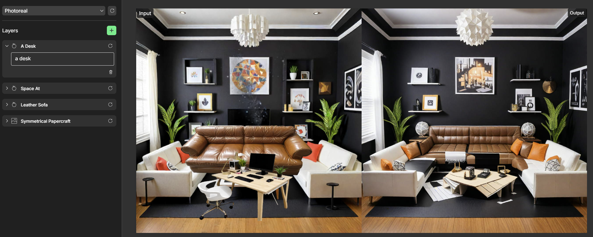{ width=10cm }

- Microsoft Designer en [https://designer.microsoft.com/](https://designer.microsoft.com/) es una herramienta de diseño gráfico impulsada por IA que ayuda a crear diseños profesionales. Es muy interesante ya que te permite crear imágenes con un tamaño optimizado para presentaciones, cualquier documento de Office, o para publicaciones de Instagram, etc.

- [Simpleshow](https://videos.simpleshow.com) es una herramienta que nos permite crear videotutoriales planteándole un prompt. Esta la hemos utilizado en el módulo I para crear el video de presentación.

## ¿Cuál elegir?

Hoy en día podemos encontrar el uso de la IA prácticamente en cualquier herramienta o dispositivo. Estamos ante una tecnología que ha tenido su boom en los últimos dos años y cada vez habrá más y más oferta de este tipo de herramientas. Si el uso que le darás es esporádico, es recomendable utilizar aquellas que son gratuitas.

# Generación de materiales didácticos

Las siguientes herramientas nos permiten crear materiales de manera rápida y sencilla ya preparados para publicar.

:::warning
Ten en cuenta que los materiales que genera están basados en otros materiales que tiene como referencia la IA. Y pueden ser o no adecuados a lo que esperas, todo lo que crea es necesario revisarlo.
:::

## Mindsmith

[Mindsmith](https://www.mindsmith.ai/) es una de las plataformas existentes para crear materiales a modo de presentación:

{ width=10cm }

Le damos un prompt para que nos genere unos materiales generales. Ten en cuenta todo lo que hemos visto sobre prompts, cuanto más detallado sea el prompt, mejores resultados obtendremos. Además, genera un cuestionario sobre la unidad creada. Te dejamos una unidad de ejemplo creada con Mindsmith:

[https://app.mindsmith.ai/learn/clrxvtgi8009ijn083uor8946](https://app.mindsmith.ai/learn/clrxvtgi8009ijn083uor8946)

:::caution
La plataforma nos limita a la creación de 5 unidades y solo nos deja compartir dos a no ser que paguemos la cuota.
:::

## LearningStudioAI

Una herramienta interesante es [LearningStudioAI](https://learningstudioai.com/) para generar automáticamente cursos. Nos permite crear cursos a partir de textos que le proporcionemos. Nos genera un curso con diferentes módulos y nos permite descargarlo en formato SCORM para poder subirlo a nuestra plataforma de formación.


## Schemely

[Schemely](https://schemely.app/) es una plataforma de creación de cursos para profesores, con IA generativa. Es bastante completa y nos permite enlazar la planificación generada con otras herramientas para crear materiales adicionales.

:::note
Cuando nos pide el título del curso, piensa que estás realizando el prompt al modelo, por lo tanto, puedes ser detallista al respecto.
:::


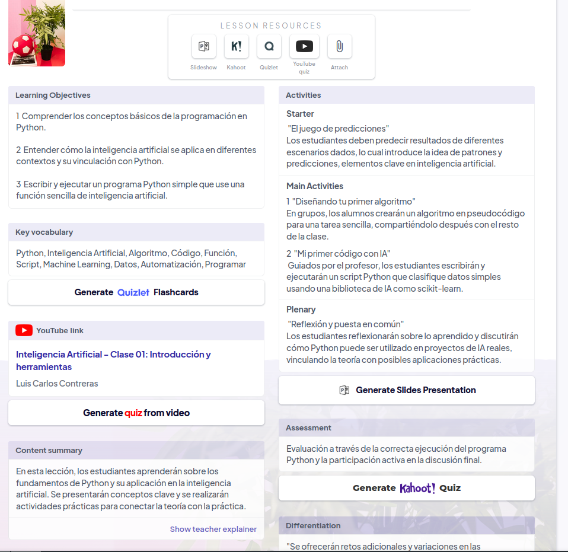

Es interesante ver cómo ya nos aparecen los enlaces para que con otras herramientas se cree esta parte del curso.

:::note
Esta herramienta nos permite crear dos cursos al mes de manera gratuita. Se renueva cada mes.
:::

## TutorAI

[TutorAI](https://www.tutorai.me/) es una aplicación pensada para el autoaprendizaje. Le planteamos un tema y nos dará diferentes módulos para poder aprender.

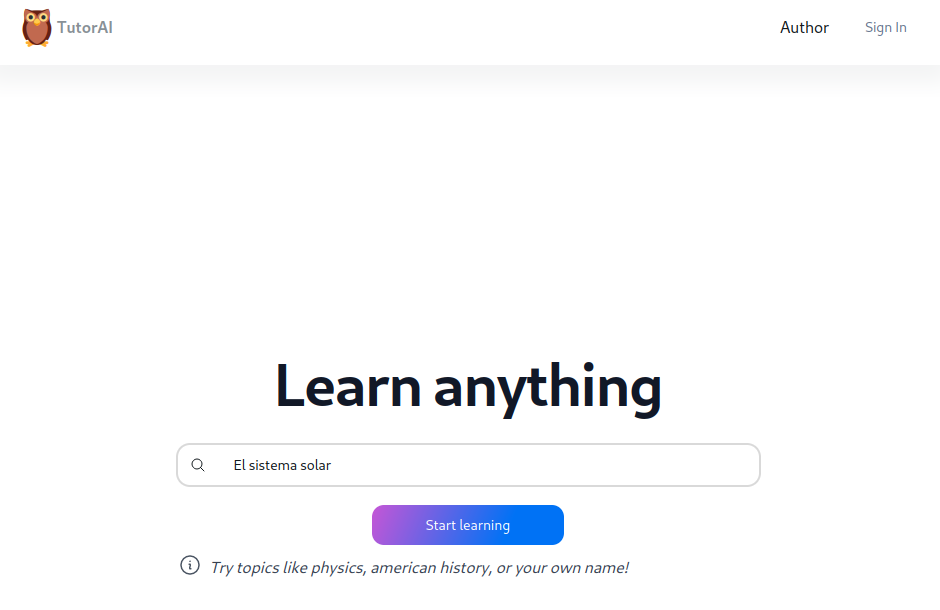

## MagicSchoolAi

[MagicSchoolAi](https://www.magicschool.ai/) es un conjunto de herramientas agrupadas que nos permite crear materiales para el aula. Una opción interesante es la de crear un cuestionario a partir de una temática. Los cuestionarios de este curso están creados con esta herramienta.


:::note
Al igual que las otras, nos da un período gratuito de prueba. Pero posteriormente, aunque no se puedan utilizar todas las herramientas, las que puedes usar son de gran utilidad. Es probablemente una de las herramientas más útiles.
:::

## Otras herramientas

Existen multitud de herramientas. Pero todas ellas son similares para crear materiales. Te proponemos que eches un vistazo a otras herramientas como:

### Quizgecko

[Quizgecko](https://quizgecko.com/) es una plataforma de creación de cuestionarios en línea que nos ayuda a crear cuestionarios interactivos y atractivos para los estudiantes.


### Quillionz

[Quillionz](https://app.quillionz.com/) es una herramienta que utiliza inteligencia artificial para generar automáticamente preguntas de opción múltiple, de discusión abiertas o «interpretativas» y de debates con las respuestas correspondientes, a partir de documentos adjuntados. La herramienta es totalmente gratuita, aunque tiene cuentas Premium o de pago, con más funciones.

### GitMind

[GitMind](https://gitmind.com/es/) es una aplicación gratuita de mapas mentales y lluvia de ideas. También funciona por créditos y nos permite crear esquemas de una manera bastante eficiente.


# Otras herramientas interesantes

## ChatPDF

Personalmente [ChaPDF](https://www.chatpdf.com) es una de las aplicaciones que más utilizo. En este caso se puede subir un PDF y "hablar" con él, puedes hacerle preguntas diversas. En este caso hemos subido la normativa de cursos. Las respuestas que da no son 100% correctas pero te puede dar una idea y, lo mejor, es que te enlaza la respuesta a la parte del documento donde se habla de ese tema:

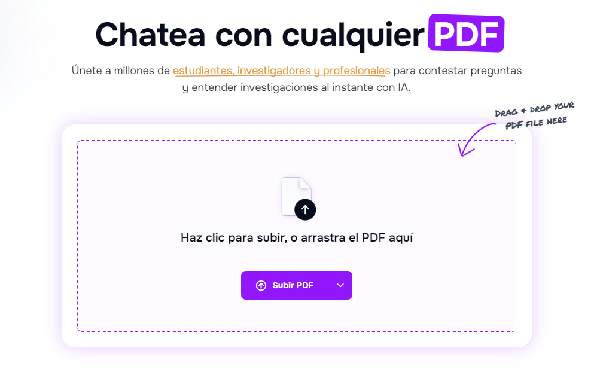


:::note
Algunos PDF pueden ser demasiado grandes y no los acepta. Por lo tanto, es necesario subir PDF comprimidos (utilizando la herramienta de [https://www.ilovepdf.com/es/comprimir_pdf](https://www.ilovepdf.com/es/comprimir_pdf)).
:::

# Notebook LM

Personalmente, esta herramienta es una de las que más me gusta. Al igual que ChatPDF, puedes subir documentos, vídeos o simplemente pegar texto (hasta 50 fuentes) y hacerle preguntas, pero dispone de otras características que resultan muy interesantes. Puedes encontrar la herramienta [aquí](https://notebooklm.google.com/). Se trata de una herramienta totalmente gratuita y utiliza el modelo de Gemini 2.0.


Una vez nos registremos (con un correo de Google) tendremos acceso a la plataforma:

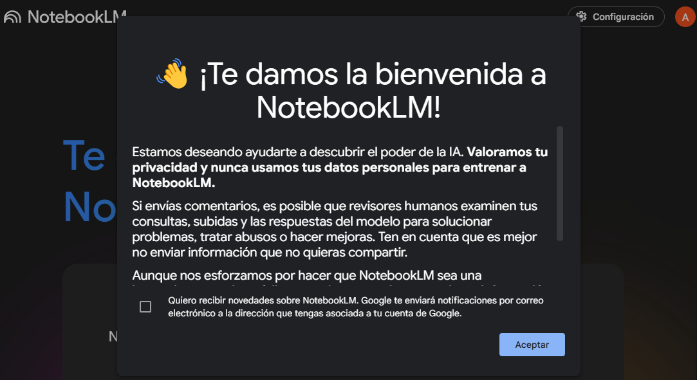

Podemos ver un entorno como este, en la parte derecha podemos subir los documentos con los que queremos hablar, nos puede hacer resúmenes, audios (de momento en inglés), nos puede hacer preguntas, etc.


Si hacemos clic en "Añadir Fuente" (hasta 50 documentos), podemos ver que nos permite subir documentos con diferentes tipos de formatos (audio en mp3, pdf, sitios web, videos de YouTube o simplemente copiar y pegar texto).


Hemos probado a hacer un resumen de un documento del DOGV (que probablemente no estará entrenado con legislación actual) para probar la herramienta y podemos ver el resultado. El resumen es bastante acertado:

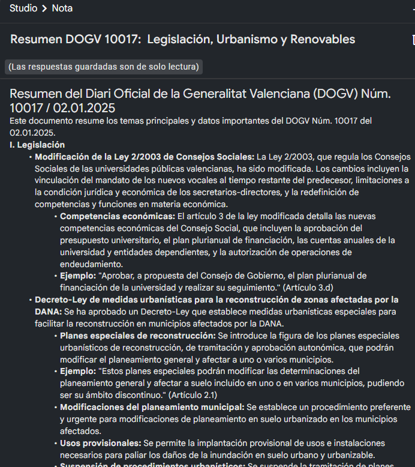

Podemos realizar preguntas más genéricas y podemos ver que el razonamiento es bastante acertado:


Y una de las características que más me gusta (aunque de momento está en inglés) es que te hace un resumen con audio. Parecen dos personas conversando con una voz totalmente normal, no es robótica ni parece creada por una IA.

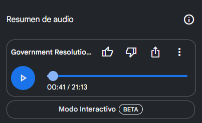

## Geospy

[Geospy](https://geospy.web.app/) es una herramienta que nos permite conocer el lugar de donde es una imagen. Es muy interesante porque te da un razonamiento de por qué cree que es ese lugar u otro. Muchos pensarán que utiliza los metadatos para saberlo pero, dados los razonamientos, te hacen dudar. Los resultados suelen ser bastante certeros, pero en el ejemplo podemos ver que no siempre es fiable (se trata de una fotografía de la superficie de la luna):


# ComfyUI

[ComfyUI](https://comfyui.org/) es una herramienta que nos permite crear una interfaz de usuario para cualquier aplicación o página web. Es una herramienta muy interesante para crear una interfaz de usuario atractiva y fácil de usar.

Esta herramienta es fundamental para ver cómo funciona la creación de imágenes con diferentes modelos. No vamos a entrar en detalle sobre su funcionamiento ya que prácticamente requeriría un curso completo para explicar todas sus posibilidades y un ordenador muy potente.

Su instalación no es habitual y tiene cierta complejidad. Pero una vez configurada es una herramienta que vale la pena tener, ya que nos permitirá crear imágenes (y si tienes un ordenador muy, muy, muy potente, videos) de manera ilimitada.

Puedes descargar la herramienta desde [aquí](https://github.com/comfyanonymous/ComfyUI/releases/latest/download/ComfyUI_windows_portable_nvidia.7z). Una vez descargado, descomprime el archivo haciendo clic con el botón derecho del ratón.


:::warning
Asegúrate de tener suficiente espacio ya que la instalación ocupa bastante (unos 5GB).
:::

Para descargar un modelo de ejemplo, puedes ir a [https://civitai.com/models/4384/dreamshaper](https://civitai.com/models/4384/dreamshaper) y descargar ese modelo. Civitai es una página que nos permite descargar modelos de manera gratuita, pero no todos los modelos te funcionarán. También puedes usar Hugging Face para descargar modelos. Para descargar un modelo de Hugging Face, ve a [https://huggingface.co/](https://huggingface.co/) y descarga el modelo que más te interese. El modelo que te proponemos es el de DreamShaper, que es un modelo ligero para crear imágenes anime. Aun así, prueba cuánto tiempo tarda en crear una imagen en tu ordenador. En mi caso, con un ordenador estándar tarda unos 13 minutos en crear una imagen. Con una tarjeta gráfica NVIDIA (1650 GTX, que es bastante antigua) tarda unos 3 minutos.


:::caution
Nos centraremos solo en la creación de imágenes, ya que puedes tardar mucho tiempo creando un video con un ordenador estándar (me refiero a un ordenador estándar, un ordenador de hace 3-4 años con 8GB de RAM y un i5 o Ryzen5).
:::

Una vez hemos descargado el modelo, lo debemos colocar en la siguiente carpeta: **\\ComfyUI_windows_portable\\ComfyUI\\models\\checkpoints**. 

Finalmente, si entramos en la carpeta, podemos ver que hay dos ejecutables. Ejecutamos run_cpu.bat. Si estamos seguros de que tenemos una tarjeta gráfica NVIDIA, podemos ejecutar run_nvidia_gpu.bat. La primera vez que lo descargues tardará un poco en cargar, pero una vez cargado ya podrás empezar a crear imágenes.


:::warning
Este proceso está explicado para un ordenador con Windows. Para usuarios Mac y Linux el proceso es bastante más complejo y necesitan tener conocimientos de Git y un poco del entorno Python (no programar con Python). Puedes encontrar información [aquí](https://comfyui-wiki.com/es/install/install-comfyui/install-comfyui-on-linux).
:::

La primera vez que ejecutes la aplicación, te aparecerá ya un diagrama de flujo donde tendrás dos recuadros para añadir un prompt y un prompt negativo.

* El prompt de la imagen debe ser detallado, cuanto más detallado mejor.
* El prompt negativo es lo que no queremos que aparezca en la imagen.

Obviamente el modelo puede interpretar el prompt de manera diferente a lo que piensas, y será necesario ir modificándolo hasta conseguir el resultado deseado.

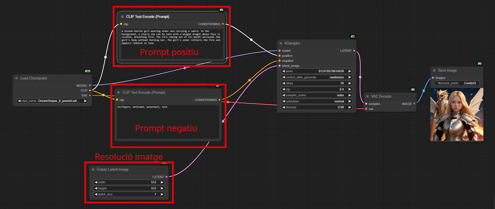

Este programa permite ir más allá y se pueden hacer muchas más cosas. Seguro que muchas veces te preguntas, ¿por qué no sale la imagen que quiero si estoy detallando muy bien el prompt? Fíjate que en este caso también puedes jugar con los parámetros del modelo. Y un concepto interesante que podemos usar es el de "LoRA" (Low-Rank Adaptation), que son elementos que podemos añadir al modelo que están entrenados para tareas específicas. En este caso hemos usado un **LoRA** que adapta el modelo para la creación de logos, podemos ver la diferencia:


La mayoría de los modelos de generación de imágenes que podemos encontrar en diferentes páginas de internet no nos permiten crear adaptaciones de los modelos. Este programa nos permite afinar más en la creación de las imágenes, pero tiene su complejidad. Además, permite la creación de videos, pero como ya hemos comentado, es necesario tener un ordenador muy potente para poder crearlos.

# ¿Y si no encuentro lo que busco?

Aquí hemos tratado de exponeros diversas herramientas que utilizan la IA. Hay muchísimas y cada vez existen más y más. Existe una página que va recopilando todas y cada una de ellas. Si no encuentras lo que buscas o buscas alguna alternativa, puedes visitar la siguiente página. Siempre habrá alguna que se adapte a lo que estás buscando.

https://theresanaiforthat.com/

Hay que tener en cuenta que el gran boom de la inteligencia artificial fue en 2022. Cada vez existirán mejores herramientas y más accesibles, más económicas o incluso más gratuitas. Estas propuestas que te planteamos son para que veas qué es lo que nos espera en los próximos años y vayas acostumbrándote a utilizar este tipo de herramientas e implementándolas en tu aula. Solo hay que pensar cómo estábamos con los móviles hace 10 años y lo caras que eran las llamadas...

Te dejamos para finalizar esta unidad una frase extraída de un artículo que invita a la reflexión:

> “¿Recuerdan el popular portal 'El rincón del vago'? Pues ni en sus mejores sueños pudieron imaginar los plagiadores la llegada de un instrumento tan eficaz. Fue cuestión de tiempo que universidades americanas y australianas prohibieran el uso de esta herramienta para lograr que sus estudiantes copiasen.
Dado que la historia nos enseña que la evolución tecnológica es casi imposible de contener, hubo visiones que preferían que se afrontara el debate de cómo incorporar el uso de ChatGPT a las aulas y al aprendizaje.
La inteligencia artificial revolucionará, de alguna manera u otra, el papel del profesor. Ahora el conocimiento ya no pertenece exclusivamente al maestro, sino que está por todas partes. Pero evidentemente, el docente es y seguirá siendo la persona adecuada que ayude a los alumnos a interpretarlo."[^4]

[^4]: https://www.eldebate.com/educacion/20230415/chatgpt-educacion-enemigo-aliado-profesores_106508.html
